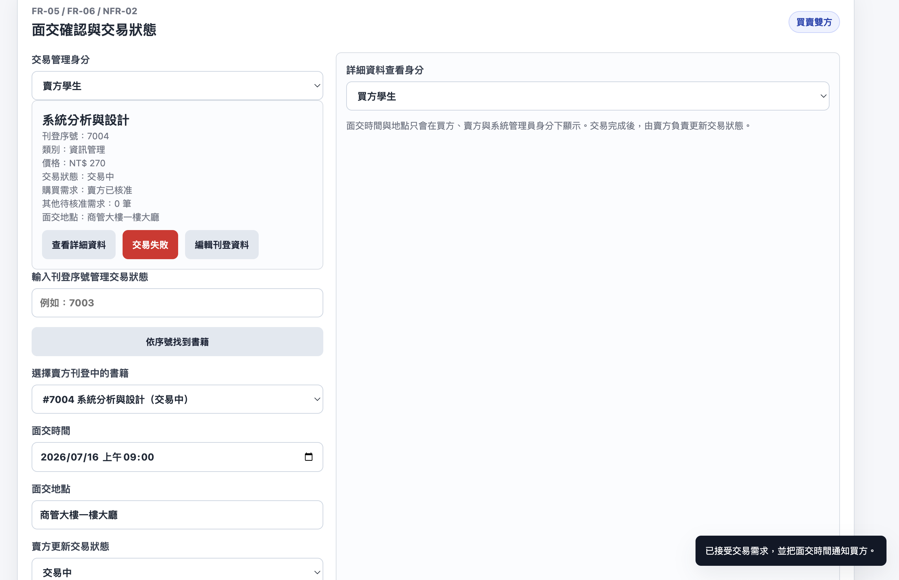
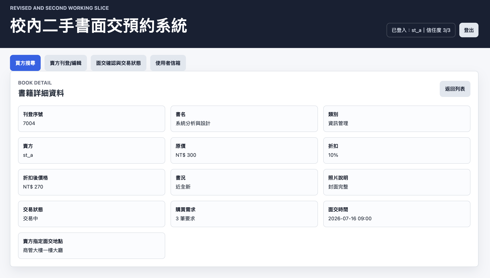
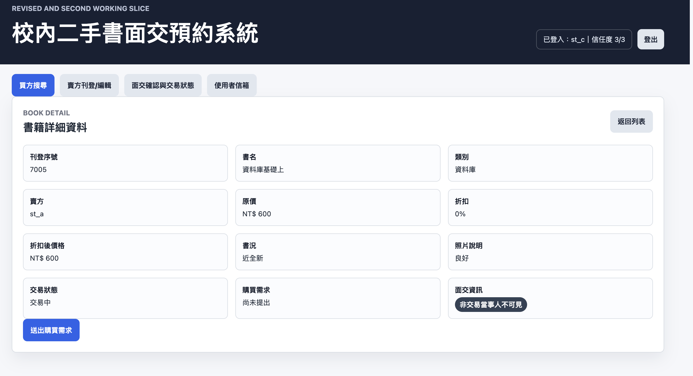

# 0714 使用者故事、驗收條件、需求排序與實作修正

## A. 小組基本資料

```text
課程名稱：系統分析與設計
日期：115/07/14
小組名稱：Group07
專案名稱：校內二手書面交預約系統
組員與分工：孫梓翔
GitHub 儲存庫連結：https://github.com/Raito411/TKU_114-3_SAD_Group07
7/13 成果資料夾連結：https://github.com/Raito411/TKU_114-3_SAD_Group07/tree/main/0713_Requirements_Code_Agent
0714 成果資料夾連結：https://github.com/Raito411/TKU_114-3_SAD_Group07/tree/main/0714_User_Stories_Acceptance_Implementation
```

## B. 進入條件檢查

| 項目             | 版本或連結                                                          | 狀態 | 問題與補救方式                                                            | 負責人 |
| ---------------- | ------------------------------------------------------------------- | ---- | ------------------------------------------------------------------------- | ------ |
| 專案章程第 2 版  | `0708_Project_Charter_Studio/project_charter_v2.md`               | 已有 | 主要內容 commit：`d1f772a2`                                               | 孫梓翔 |
| 需求來源表       | `0713_Requirements_Code_Agent/requirements_source_table.md`       | 已有 | 目前來源主要為 Project Charter v2 與模擬訪談，後續可加入實際訪談          | 孫梓翔 |
| 候選需求清單     | `0713_Requirements_Code_Agent/candidate_requirements.md`          | 已有 | FR-05、FR-06、NFR-02 已由第二個可操作切片示意支援；FR-07 已以交易失敗、信任度 0 停權與資料清理呈現基本管理規則 | 孫梓翔 |
| 7/13 實作任務書  | `0713_Requirements_Code_Agent/code_agent_implementation_brief.md` | 已有 | 需在 0714 更新為修正或第二切片任務書                                      | 孫梓翔 |
| 第一個可操作切片 | `0713_Requirements_Code_Agent/first_working_slice/`               | 已有 | 0714 已另以修正版切片與 MAT-01 至 MAT-13 補上測試結果與 evidence          | 孫梓翔 |
| 程式碼代理紀錄   | `0713_Requirements_Code_Agent/code_agent_log.md`                  | 已有 | 0714 使用紀錄已補於`ai_code_agent_log.md`                                 | 孫梓翔 |

## C. 使用者故事清單

| 故事編號 | 角色                             | 我想要                                                     | 以便                                                         | 來源編號             | 來源強度 | 待確認問題                                               |
| -------- | -------------------------------- | ---------------------------------------------------------- | ------------------------------------------------------------ | -------------------- | -------- | -------------------------------------------------------- |
| US-01    | 買方學生                         | 依書名、類別或關鍵字搜尋二手書                             | 快速找到需要的教材                                           | FR-01                | 中       | 是否需要加入課程名稱作為搜尋條件仍需確認                 |
| US-02    | 買方學生                         | 點選查看詳細資料並進入詳細資料頁面                         | 判斷交易是否仍有效並確認是否方便面交                         | FR-02、BR-05         | 中       | 已確認詳細資料需另頁顯示，並包含賣方刊登時決定的面交地點 |
| US-03    | 買方學生                         | 針對指定書籍送出購買需求，並取消尚未受到賣方核准的購買需求 | 讓賣方知道我有購買意願，也能在尚未核准前撤回需求             | FR-03、BR-08         | 中       | 購買需求送出或取消後是否需要通知賣方仍需確認             |
| US-04    | 賣方學生                         | 新增一本二手書資料並指定面交地點                           | 讓買方可以在系統中看到書籍與可面交地點                       | FR-04、NFR-01、BR-05 | 中       | 課程名稱是否列為必要欄位仍需確認                         |
| US-05    | 買方學生、賣方學生               | 確認面交時間與地點                                         | 減少反覆私訊確認                                             | FR-05                | 中       | 已由第二個可操作切片以面交安排表單示意                   |
| US-06    | 買方學生、賣方學生               | 依身分查看交易狀態與資料                                   | 買方知道自己交易中的書籍進度，賣方管理自己刊登書籍的交易狀態 | FR-06                | 中       | 已由修正版切片以身分切換與假資料狀態更新示意             |
| US-07    | 系統管理員                       | 處理不符合規範、已完成交易或不適合繼續使用系統的使用者資料 | 維護資料品質與交易資訊正確性                                 | FR-07、BR-02、BR-03  | 中       | 已以信任度 0 停權與資料清理呈現基本管理規則               |
| US-08    | 非交易當事人、買方學生、賣方學生 | 面交時間與地點不被非交易當事人看到                         | 降低個資與安全疑慮                                           | NFR-02               | 中       | 已改為依登入者與交易關係自動判斷                         |
| US-09    | 賣方學生                         | 用百分比設置二手書折扣                                     | 讓買方能清楚看到折扣後價格                                   | FR-08                | 中       | 已確認折扣用百分比呈現，並同時顯示折扣後價格             |
| US-10    | 賣方學生                         | 更改刊登中的書籍資料                                       | 讓刊登資訊維持正確                                           | FR-09、BR-06         | 中       | 使用者新增需求，使用前端假資料示意                       |
| US-11    | 賣方學生                         | 輸入刊登序號找到書籍並管理交易狀態                         | 快速定位指定交易                                             | FR-10、BR-07         | 中       | 使用者新增需求，序號以假資料自動產生                     |
| US-12    | 系統                             | 使用資料庫保存交易資料                                     | 重新啟動後仍保留書籍、購買需求、交易狀態與使用者信箱通知資料 | FR-11、DR-06         | 中       | 正式資料庫後端已建立                                     |
| US-13    | 學生使用者                       | 註冊並登入同一個學生帳號                                   | 可以用同一帳號買或賣二手書                                   | FR-12                | 中       | 不串接學校正式單一登入或真實身分驗證                     |

## C-1. 使用者故事品質檢查

| 故事編號 | 獨立 | 可協商 | 有價值 | 可估算 | 小型 | 可測試       | 修正內容                                   |
| -------- | ---- | ------ | ------ | ------ | ---- | ------------ | ------------------------------------------ |
| US-01    | 是   | 是     | 是     | 是     | 是   | 是           | 保留待確認問題：是否加入課程名稱搜尋       |
| US-04    | 是   | 是     | 是     | 是     | 是   | 是           | 保留待確認問題：課程名稱是否必要           |
| US-07    | 是   | 是     | 是     | 是     | 是   | 是           | 已由 MAT-13 驗收信任度 0 停權與資料清理    |

## D. 功能性需求清單

| 需求編號 | 觸發角色或事件             | 前提條件                                             | 系統行為                                                                                                           | 可觀察結果                                                                                             | 使用者故事 | 來源編號                    | 待確認問題                                       |
| -------- | -------------------------- | ---------------------------------------------------- | ------------------------------------------------------------------------------------------------------------------ | ------------------------------------------------------------------------------------------------------ | ---------- | --------------------------- | ------------------------------------------------ |
| FR-01    | 買方學生搜尋書籍           | 系統已有書籍資料                                     | 系統應允許買方依書名、類別或關鍵字搜尋二手書                                                                       | 列表顯示符合條件的書籍                                                                                 | US-01      | FR-01                       | 是否需要加入課程名稱作為搜尋條件仍需確認         |
| FR-02    | 買方學生查看書籍           | 系統已有書籍資料                                     | 系統應在買方點選查看詳細資料後進入詳細資料頁面，並顯示書籍詳細資料、交易狀態與賣方指定面交地點                     | 買方在詳細資料頁面看到書籍資訊、目前交易狀態與賣方指定面交地點                                         | US-02      | FR-02、BR-05                | 已確認詳細資料需另頁顯示                         |
| FR-03    | 買方學生送出或取消購買需求 | 買方已選定一本書籍                                   | 系統應允許買方針對指定書籍送出購買需求；若購買需求尚未受到賣方核准，買方可取消該需求                               | 系統顯示送出成功、待賣方回覆；未核准前系統狀態維持未交易，提出需求買方看到交易預約中，取消後仍為未交易 | US-03      | FR-03、BR-08                | 是否需要通知賣方仍需確認                         |
| FR-04    | 賣方學生新增書籍           | 賣方有一本想出售的二手書                             | 系統應允許賣方新增一本二手書資料，並在刊登時決定面交地點；新增書籍時不需輸入交易狀態，系統預設為未交易             | 新增書籍出現在書籍列表中，詳細資料可看到賣方指定面交地點與未交易狀態                                   | US-04      | FR-04、NFR-01、BR-05、BR-13 | 課程名稱是否必要仍需確認                         |
| FR-05    | 買賣雙方確認面交           | 買方已提出購買需求，賣方願意交易                     | 系統應要求賣方在接受交易需求前選擇面交時間，並使用賣方指定面交地點通知買方                                         | 買方信箱收到交易核准、面交時間與面交地點通知                                                           | US-05      | FR-05、FR-13                | 已由切片與正式資料庫 API 支援                    |
| FR-06    | 依身分查看與更新交易進度   | 系統已有交易資料                                     | 系統應依身分顯示不同交易狀態內容：買方可查看自己交易中的書籍狀態與資料，賣方可查看自己刊登的書籍資料並更新交易狀態 | 買方看到交易中書籍資料，賣方可更新指定書籍交易狀態                                                     | US-06      | FR-06、BR-04                | 已由修正版切片支援，使用前端假資料示意身分差異   |
| FR-07    | 系統管理員處理資料         | 有不符合規範、已完成或需要處理資格的交易與使用者資料 | 系統應提供基本管理方式，讓系統管理員處理不符合規範或已完成的交易資料，並依規則處理使用者停權                       | 不符合規範、已完成或需停權的資料可被處理；信任度達 0 時系統停權並取消該使用者刊登與購買需求                 | US-07      | FR-07、BR-02、BR-03         | 已以信任度 0 停權與資料清理規則呈現           |
| FR-08    | 賣方學生設定折扣           | 賣方正在新增二手書資料                               | 系統應允許賣方以百分比設定二手書折扣，並顯示折扣後價格                                                             | 書籍列表與詳細資料顯示原價、折扣百分比與折扣後價格                                                     | US-09      | 使用者新增需求              | 已確認折扣只用百分比顯示，且同時顯示折扣後價格   |
| FR-09    | 賣方學生更改刊登資料       | 系統已有賣方刊登中的書籍資料                         | 系統應允許賣方隨時更改刊登中的書籍資料                                                                             | 更新後的書籍資料會反映在列表與詳細資料頁面                                                             | US-10      | 使用者新增需求、BR-06       | 已由修正版切片與 MAT-09 驗收                       |
| FR-10    | 賣方學生以序號管理交易狀態 | 系統已有刊登中的書籍資料，且每筆書籍有唯一刊登序號   | 系統應允許賣方輸入刊登序號找到指定書籍並管理交易狀態                                                               | 系統帶入指定書籍，賣方可更新該筆交易狀態                                                               | US-11      | 使用者新增需求、BR-07       | 已建立資料庫後端保存刊登序號與交易狀態           |
| FR-11    | 系統保存交易資料           | 系統已有使用者、書籍或購買需求資料                   | 系統應使用資料庫保存使用者、書籍刊登、購買需求、交易狀態與使用者信箱通知資料                                       | 重新啟動後資料仍可由資料庫讀取                                                                         | US-12      | 使用者新增需求、DR-06       | 已建立正式資料庫後端並與修正版切片註冊/登入流程串接 |
| FR-13    | 使用者信箱查看通知         | 使用者已登入且系統產生通知                           | 系統應將賣方核准購買需求或更新面交資訊後產生的通知寫入該使用者信箱，而不是顯示在面交確認與交易狀態區               | 使用者可在自己的信箱查看通知內容，包含交易核准與面交時間                                               | US-14      | 使用者新增需求、DR-06       | 已建立`/api/mailbox` 與信箱分頁                |
| FR-12    | 使用者註冊與登入           | 使用者尚未登入系統                                   | 系統應允許使用者註冊學生帳號並登入；同一個學生帳號可刊登書籍，也可送出購買需求                                     | 登入後可用同一帳號買或賣二手書                                                                         | US-13      | 使用者新增需求              | 已建立正式註冊/登入頁與 API                      |

## E. 非功能性需求清單

| 需求編號 | 品質類型           | 適用情境                     | 系統回應                                                                                                    | 可檢查標準                                                                                                           | 環境或限制                                                         | 來源或依據                                                 | 確認狀態                                       |
| -------- | ------------------ | ---------------------------- | ----------------------------------------------------------------------------------------------------------- | -------------------------------------------------------------------------------------------------------------------- | ------------------------------------------------------------------ | ---------------------------------------------------------- | ---------------------------------------------- |
| NFR-01   | 資料完整性         | 賣方刊登二手書資料           | 書籍刊登資料應包含刊登序號、書名、類別、價格、書況、照片、賣方指定面交地點與交易狀態                        | 新增書籍表單與詳細資料可看到必要欄位，且刊登序號不重複                                                               | HTML、CSS、JavaScript 與假資料原型                                 | NFR-01、FR-04、BR-05、BR-07                                | 已納入修正版切片                               |
| NFR-02   | 隱私與安全         | 非交易當事人瀏覽公開書籍資訊 | 面交時間與地點不應顯示給非交易當事人                                                                        | 非交易當事人只能看到公開書籍資訊                                                                                     | 靜態切片使用身分切換示意；正式版使用登入帳號與資料庫               | NFR-02、Project Charter v2 初步成功標準 6                  | 已納入第二個可操作切片與正式登入後端           |
| NFR-03   | 易用性             | 買方或賣方使用修正版切片     | 新增/編輯書籍、搜尋、查看詳細資料、送出購買需求、交易狀態管理與信箱查看應能在同一原型內透過清楚分頁切換完成 | 使用者可在買方搜尋、賣方刊登/編輯、面交確認與交易狀態、使用者信箱四個分頁間切換                                      | HTML、CSS、JavaScript 單頁原型                                     | 0713 第一個可操作切片、0714 修正版切片、使用者補充設計需求 | 已納入修正版切片                               |
| NFR-04   | 可理解性           | 買方查看有折扣的二手書       | 書籍列表與詳細資料應清楚顯示原價、折扣百分比與折扣後價格                                                    | 買方能同時看到原價、折扣百分比與折扣後價格                                                                           | 折扣僅使用前端假資料呈現，不涉及付款                               | FR-08、AC-08-01                                            | 已確認折扣只用百分比顯示，且同時顯示折扣後價格 |
| NFR-05   | 範圍控制／資料安全 | 原型展示或測試時             | 系統不得儲存真實個資、付款資料或面交私密資訊                                                                | 資料庫僅保存系統必要的使用者、書籍、購買需求、交易狀態與使用者信箱通知資料，且不串接學校正式登入、付款或真實身分驗證 | 本期可使用資料庫與自建登入；不串接學校正式登入、真實身分驗證或金流 | Project Charter v2 範圍內資料庫與登入項目、CON-01、CON-03  | 已依正式登入版本修正                           |

## E-1. 品質屬性情境

| 非功能性需求 | 來源                                                       | 刺激                 | 環境                 | 對象                 | 回應                                              | 回應量測                                                                               |
| ------------ | ---------------------------------------------------------- | -------------------- | -------------------- | -------------------- | ------------------------------------------------- | -------------------------------------------------------------------------------------- |
| NFR-01       | NFR-01、FR-04、BR-05、BR-07                                | 賣方新增書籍         | 靜態網頁原型         | 書籍資料             | 顯示必要欄位且刊登序號不重複                      | 表單與詳細資料可檢查刊登序號、書名、類別、價格、書況、照片、賣方指定面交地點與交易狀態 |
| NFR-02       | NFR-02                                                     | 非交易當事人瀏覽書籍 | 面交資訊存在時       | 面交時間與地點       | 不顯示給非交易當事人                              | 切換為非交易當事人時，詳細資料不顯示面交時間與地點                                     |
| NFR-03       | 0713 第一個可操作切片、0714 修正版切片、使用者補充設計需求 | 使用者執行主要流程   | 單頁 HTML 原型       | 買方與賣方操作流程   | 以分頁切換整理新增/編輯、搜尋、查看與狀態管理流程 | 操作過程可在同一原型內切換分頁完成                                                     |
| NFR-04       | FR-08、AC-08-01                                            | 買方查看折扣書籍     | 書籍列表與詳細資料   | 價格資訊             | 顯示原價、折扣與折扣後價格                        | 買方可直接比較原價與折扣後價格                                                         |
| NFR-05       | Project Charter v2、CON-01、CON-03                         | 原型展示或測試       | 資料庫後端與前端原型 | 使用者資料與交易資料 | 不串接學校正式帳號、付款資料或真實身分驗證        | 檢查資料庫與畫面沒有付款、學校正式登入或真實身分驗證欄位                               |

## F. 業務規則、資料需求與限制條件

| 類型     | 編號   | 內容                                                                                                                           | 來源或推導依據                                                 | 確認狀態                     |
| -------- | ------ | ------------------------------------------------------------------------------------------------------------------------------ | -------------------------------------------------------------- | ---------------------------- |
| 業務規則 | BR-01  | 面交時間與地點僅能被買方、賣方及系統管理員讀取，非交易當事人只能看到公開書籍資訊。                                             | Project Charter v2 初步成功標準 6、NFR-02                      | 已由第二個可操作切片示意     |
| 業務規則 | BR-02  | 系統管理員可處理不符合規範的刊登內容，並下架已完成或不適合保留的交易資料。                                                     | Project Charter v2 範圍內項目 6、FR-07                         | 已以基本管理規則呈現         |
| 業務規則 | BR-03  | 系統管理員可根據情況將系統使用者停權。                                                                                         | Project Charter v2 目標使用者：系統管理員處理買賣方資格、FR-07 | 已以信任度 0 停權規則呈現   |
| 業務規則 | BR-04  | 賣方核准購買需求後，系統自動將交易狀態由未交易改為交易中；交易完成後由賣方負責將交易狀態從交易中更新為交易完成。               | 使用者補充需求、FR-06                                          | 已確認                       |
| 業務規則 | BR-05  | 賣方刊登書籍時需決定面交地點，買方可透過查看詳細資料看到該地點。                                                               | 使用者補充需求、FR-02、FR-04                                   | 已確認                       |
| 業務規則 | BR-06  | 賣方可以隨時更改刊登中的書籍資料。                                                                                             | 使用者補充需求、FR-09                                          | 已確認                       |
| 業務規則 | BR-07  | 每筆刊登中的書籍需有一組數字刊登序號，且刊登中的序號兩兩不重複。                                                               | 使用者補充需求、FR-10                                          | 已確認                       |
| 業務規則 | BR-08  | 買方已送出但尚未受到賣方核准的購買需求，可以由買方隨時取消；未核准前系統交易狀態顯示未交易，提出需求的買方本人看到交易預約中。 | 使用者補充需求、FR-03                                          | 已確認                       |
| 業務規則 | BR-09  | 賣方對同一本書一次只能核准一位買方；賣方核准其中一筆購買需求後，其他人的待核准購買需求會由系統自動取消。                       | 使用者補充需求、FR-03、FR-06                                   | 已確認                       |
| 業務規則 | BR-10  | 賣方不可對自己刊登的書籍送出購買需求。                                                                                         | 使用者補充需求、FR-03、FR-12                                   | 已確認                       |
| 業務規則 | BR-13  | 賣方新增書籍時不需輸入交易狀態；新增後系統預設交易狀態為未交易。                                                               | 使用者補充需求、FR-04                                          | 已確認                       |
| 資料需求 | DR-01  | 書籍資料包含刊登序號、書名、類別、價格、書況、照片、賣方指定面交地點與交易狀態。                                               | NFR-01、Project Charter v2 範圍內項目 2、BR-05、BR-07          | 已納入修正版切片             |
| 資料需求 | DR-02  | 面交資料包含面交時間與地點。                                                                                                   | FR-05、Project Charter v2 核心任務 3                           | 已納入第二個可操作切片       |
| 資料需求 | DR-03  | 交易狀態至少需能表達未交易、交易預約中、交易中、交易完成；交易預約中為提出需求買方的視角狀態。                                 | FR-06、Project Charter v2 範圍內項目 5                         | 已納入第二個可操作切片       |
| 資料需求 | DR-04  | 刊登序號為一串數字，可用於賣方定位指定書籍並管理交易狀態。                                                                     | 使用者補充需求、FR-10、BR-07                                   | 已納入修正版切片             |
| 資料需求 | DR-05  | 書籍需能表示是否有其他待核准購買需求，供賣方核准一筆後自動取消其餘需求。                                                       | BR-09、FR-03                                                   | 已納入修正版切片             |
| 資料需求 | DR-06  | 系統需以資料庫保存使用者、書籍刊登、購買需求、交易狀態與使用者信箱通知資料。                                                   | 使用者補充需求、Project Charter v2 範圍內項目                  | 已建立正式資料庫後端         |
| 限制條件 | CON-01 | 本期原型不得加入線上付款或第三方金流。                                                                                         | 0713 候選需求清單、Project Charter v2 範圍外項目               | 已確認                       |
| 限制條件 | CON-02 | 本期原型不得做手機原生 App。                                                                                                   | 0713 候選需求清單、Project Charter v2 範圍外項目               | 已確認                       |
| 限制條件 | CON-03 | 本期系統不得串接學校正式單一登入、正式學校帳號或真實身分驗證。                                                                 | 0713 候選需求清單、Project Charter v2 範圍外項目               | 已確認                       |

## G. 驗收條件

| 驗收編號     | 對應需求                    | 情境類型 | 前提                                                                                 | 當                                                               | 那麼                                                                                 | 可重現 |
| ------------ | --------------------------- | -------- | ------------------------------------------------------------------------------------ | ---------------------------------------------------------------- | ------------------------------------------------------------------------------------ | ------ |
| AC-01-01     | FR-01                       | 正常     | 系統已有書籍資料                                                                     | 買方輸入書名、類別或關鍵字搜尋                                   | 列表顯示符合條件的書籍                                                               | 是     |
| AC-01-02     | FR-01                       | 例外     | 系統已有書籍資料，但沒有書名、類別或關鍵字符合買方輸入內容                           | 買方輸入不存在的書名、類別或關鍵字搜尋                           | 書籍列表不顯示不符合條件的書籍，並以空結果狀態表示目前沒有符合條件的書籍             | 是     |
| AC-01-03     | FR-01                       | 邊界     | 系統已有書籍資料                                                                     | 買方清空搜尋欄或只輸入空白後搜尋                                 | 系統回到未篩選狀態，顯示可公開瀏覽的書籍列表                                         | 是     |
| AC-02-01     | FR-02、BR-05                | 正常     | 系統已有書籍資料                                                                     | 買方點選查看詳細資料                                             | 系統進入詳細資料頁面，並顯示書籍完整資訊、賣方指定面交地點與交易狀態                 | 是     |
| AC-02-02     | FR-02                       | 例外     | 買方欲查看的書籍已不存在、已被移除或無法由目前列表取得                               | 買方嘗試進入該書籍詳細資料                                       | 系統不顯示錯誤書籍資料，並回到書籍列表或顯示找不到該書籍的提示                       | 是     |
| AC-03-01     | FR-03                       | 正常     | 買方已選定指定書籍                                                                   | 買方送出購買需求                                                 | 系統顯示送出成功或待賣方回覆狀態                                                     | 是     |
| AC-03-02     | FR-03、BR-08                | 正常     | 買方已送出購買需求，系統交易狀態為未交易，提出需求買方看到交易預約中，且賣方尚未核准 | 買方點選取消購買需求                                             | 系統移除購買需求狀態，書籍狀態維持未交易                                             | 是     |
| AC-03-03     | FR-03、BR-08                | 例外     | 購買需求已由賣方核准，交易狀態為交易中或交易完成                                     | 買方嘗試取消購買需求                                             | 系統不提供取消入口或提示此需求已由賣方核准，不能取消                                 | 是     |
| AC-03-04     | FR-03、FR-06、BR-04         | 正常     | 買方已送出購買需求，系統交易狀態為未交易，提出需求買方看到交易預約中                 | 賣方點選接受交易需求                                             | 系統自動將交易狀態更新為交易中，並將購買需求顯示為賣方已核准                         | 是     |
| AC-03-05     | FR-03、FR-06、BR-09         | 正常     | 同一本書有多筆待核准購買需求                                                         | 賣方接受其中一筆交易需求                                         | 系統只保留被核准的交易，並自動取消其他人的待核准購買需求                             | 是     |
| AC-04-01     | FR-04、NFR-01、BR-05、BR-13 | 正常     | 賣方有一本想出售的二手書                                                             | 賣方輸入書名、類別、價格、書況、照片說明與賣方指定面交地點並送出 | 新增後的書籍出現在書籍列表中，詳細資料可看到賣方指定面交地點，且交易狀態預設為未交易 | 是     |
| AC-05-01     | FR-05、FR-06、BR-04         | 正常     | 買方已提出購買需求，賣方願意交易                                                     | 使用者切換交易管理身分                                           | 買方身分顯示自己交易中的書籍狀態與資料，賣方身分顯示自己刊登書籍並可更新交易狀態     | 是     |
| AC-NFR-02-01 | NFR-02                      | 品質     | 書籍已有面交時間與地點                                                               | 非交易當事人查看書籍詳細資料                                     | 系統依登入者與交易關係自動判斷，不顯示面交時間與地點                                 | 是     |
| AC-08-01     | FR-08                       | 正常     | 賣方正在新增二手書資料                                                               | 賣方輸入原價與折扣百分比                                         | 系統顯示折扣後價格，新增後列表與詳細資料可看到原價、折扣與折扣後價格                 | 是     |
| AC-09-01     | FR-09、BR-06                | 正常     | 系統已有刊登中的書籍資料，且使用者切換為賣方學生身分                                 | 賣方在刊登清單點選編輯刊登資料，修改欄位並送出                   | 更新後的書籍資料顯示在列表與詳細資料頁面，買方搜尋列表不顯示編輯刊登資料入口         | 是     |
| AC-10-01     | FR-10、BR-07                | 正常     | 系統已有刊登中的書籍資料，且每筆書籍有唯一刊登序號                                   | 賣方輸入刊登序號並點選依序號找到書籍                             | 系統帶入該筆書籍，賣方可管理交易狀態                                                 | 是     |
| AC-11-01     | FR-11、DR-06                | 正常     | 正式資料庫後端已初始化                                                               | 系統建立或讀取資料庫                                             | SQLite 資料庫包含 users、books、purchase_requests、notifications 與 sessions 資料表  | 是     |
| AC-12-01     | FR-12                       | 正常     | 使用者尚未登入                                                                       | 使用者註冊學生帳號並登入                                         | 系統回傳 token，登入後同一學生帳號可刊登書籍並送出購買需求                           | 是     |
| AC-NFR-01-01 | NFR-01、BR-05、BR-07        | 品質     | 賣方新增或買方查看書籍                                                               | 系統顯示書籍資料                                                 | 刊登序號、書名、類別、價格、書況、照片、賣方指定面交地點與交易狀態可被檢查           | 是     |

## H. 需求品質檢查與衝突紀錄

| 問題編號 | 涉及需求      | 問題類型 | 問題說明                                                                           | 修正或待確認問題                                         | 修正後版本  | 狀態   |
| -------- | ------------- | -------- | ---------------------------------------------------------------------------------- | -------------------------------------------------------- | ----------- | ------ |
| RQ-01    | US-01、FR-01  | 待確認   | 買方是否需要用課程名稱搜尋尚未確認                                                 | 保留課程名稱為待確認，不列為已確認必要欄位               | 0714 初稿   | 待確認 |
| RQ-02    | US-07、FR-07  | 範圍界線 | 管理員功能在 Project Charter v2 中有列入，但第一個切片尚未實作                     | 本期以交易失敗、信任度 0 停權與資料清理呈現基本管理規則，避免擴大成完整審核流程 | 0714 修正版 | 已處理 |
| RQ-03    | NFR-02、BR-01 | 已處理   | 面交時間與地點隱私限制已有需求來源，第二個切片以身分切換示意非交易當事人不可見     | 已在第二個可操作切片補上面交資訊隱私呈現                 | 0714 修正版 | 已處理 |
| RQ-04    | BR-03、FR-07  | 範圍界線 | 使用者停權會牽涉帳號與權限；目前已加入自建登入，但不串接學校正式帳號或真實身分驗證 | 本期以資料庫保存信任度與停權狀態；信任度達 0 時停權並取消該使用者刊登與購買需求 | 0714 修正版 | 已處理 |

## I. 需求優先順序

| 需求編號 | 必須／應該／可以／本次不做 | 價值 | 投入 | 風險 | 依賴                     | 證據強度 | 排序理由                                                                 | 實作順序 |
| -------- | -------------------------- | ---- | ---- | ---- | ------------------------ | -------- | ------------------------------------------------------------------------ | -------- |
| FR-04    | 必須                       | 高   | 小   | 中   | NFR-01、BR-05            | 中       | 第一個切片起點，賣方需先新增書籍並指定面交地點                           | 1        |
| FR-01    | 必須                       | 高   | 小   | 中   | FR-04 或既有假資料       | 中       | 第一個切片核心，買方需搜尋書籍                                           | 2        |
| FR-02    | 必須                       | 高   | 小   | 中   | FR-01、BR-05             | 中       | 買方需查看詳細資料、賣方指定面交地點與交易狀態才能判斷是否購買           | 3        |
| FR-03    | 必須                       | 高   | 小   | 中   | FR-02                    | 中       | 第一個切片終點，買方送出購買需求                                         | 4        |
| NFR-01   | 必須                       | 高   | 小   | 中   | FR-04                    | 中       | 支援資料完整性與搜尋判斷                                                 | 5        |
| FR-06    | 應該                       | 中   | 中   | 中   | FR-03、FR-05             | 中       | Project Charter v2 有列入交易狀態追蹤，已由第二個切片以假資料示意        | 6        |
| FR-05    | 應該                       | 中   | 中   | 中   | FR-03                    | 中       | 面交預約是核心任務 3，已由第二個切片示意                                 | 7        |
| FR-07    | 可以                       | 中   | 中   | 中   | 以信任度 0 停權呈現基本管理 | 中       | 屬於基本管理範圍，已完成交易失敗、信任度與停權資料清理；不擴大成學校正式帳號系統 | 8        |
| FR-08    | 可以                       | 中   | 小   | 低   | FR-04                    | 中       | 屬於賣方新增書籍的延伸功能，可作為修正版切片的小幅補強                   | 9        |
| FR-09    | 應該                       | 中   | 小   | 中   | FR-04                    | 中       | 賣方需能修正刊登中資料，避免書籍資訊過期或錯誤                           | 10       |
| FR-10    | 應該                       | 中   | 小   | 中   | FR-04、FR-06             | 中       | 唯一序號可協助賣方快速定位刊登資料並管理交易狀態                         | 11       |

## J. 未解決問題清單

| 問題編號 | 問題                                   | 影響需求                    | 要向誰確認                 | 暫時處理方式                                | 截止時間  | 狀態   |
| -------- | -------------------------------------- | --------------------------- | -------------------------- | ------------------------------------------- | --------- | ------ |
| OI-01    | 是否需要加入課程名稱作為搜尋或刊登欄位 | US-01、US-04、FR-01、FR-04  | 買方學生、賣方學生         | 暫不列為必要欄位                            | 115/07/14 | 待確認 |
| OI-02    | 系統管理員功能是否列入期末展示         | US-07、FR-07                | 小組與課程要求             | 已列為基本管理範圍，以信任度 0 停權與資料清理呈現 | 115/07/17 | 已處理 |
| OI-03    | 面交流程與隱私限制如何在靜態原型呈現   | US-05、US-08、FR-05、NFR-02 | 小組與利害關係人           | 以面交安排表單與登入者/交易關係自動判斷示意 | 115/07/14 | 已處理 |
| OI-04    | 停權的判斷條件與本期呈現方式是什麼     | BR-03、FR-07                | 系統管理員、小組與課程要求 | 信任度最大 3，被賣方標記交易失敗扣 1，信任度達 0 時停權並取消該使用者刊登與購買需求 | 115/07/17 | 已處理 |

## K. 需求追溯矩陣初稿

| 來源                              | 使用者故事          | 功能性／非功能性需求 | 驗收條件                                         | 實作待辦 | 畫面或操作                                                           | 手動測試       | 狀態                 |
| --------------------------------- | ------------------- | -------------------- | ------------------------------------------------ | -------- | -------------------------------------------------------------------- | -------------- | -------------------- |
| FR-04、NFR-01、BR-05              | US-04               | FR-04、NFR-01        | AC-04-01、AC-NFR-01-01                           | IMP-01   | SCR-01 新增書籍表單、SCR-02 書籍列表                                 | MAT-01、MAT-02 | 修正版切片已支援     |
| FR-01                             | US-01               | FR-01                | AC-01-01                                         | IMP-02   | SCR-02 搜尋與書籍列表                                                | MAT-03         | 第一個切片已支援     |
| FR-02、BR-05                      | US-02               | FR-02                | AC-02-01                                         | IMP-03   | SCR-03 書籍詳細資料頁面                                              | MAT-04         | 修正版切片已支援     |
| FR-03、FR-06、BR-04、BR-08、BR-09 | US-03、US-06        | FR-03、FR-06         | AC-03-01、AC-03-02、AC-03-03、AC-03-04、AC-03-05 | IMP-04   | SCR-03 購買需求與取消購買需求、SCR-05 接受交易需求與自動取消其他需求 | MAT-05         | 修正版切片已支援     |
| FR-05、FR-06、BR-04、NFR-02       | US-05、US-06、US-08 | FR-05、FR-06、NFR-02 | AC-05-01、AC-NFR-02-01                           | IMP-05   | SCR-05 面交確認與交易狀態                                            | MAT-06、MAT-08 | 第二個切片已支援     |
| FR-07、BR-02、BR-03、NFR-02、FR-14、BR-11、BR-12、DR-07 | US-07、US-08、US-15 | FR-07、FR-14、NFR-02 | AC-14-01、AC-14-02                               | IMP-06、IMP-15 | SCR-05 交易失敗與信任度、SCR-09 正式資料庫後端                      | MAT-13         | 基本停權與交易失敗規則已完成 |
| 使用者新增需求                    | US-09               | FR-08                | AC-08-01                                         | IMP-07   | SCR-04 折扣設定與折扣後價格                                          | MAT-07         | 修正版切片已支援     |
| 使用者新增需求、BR-06             | US-10               | FR-09                | AC-09-01                                         | IMP-08   | SCR-06 編輯刊登資料                                                  | MAT-09         | 修正版切片已支援     |
| 使用者新增需求、BR-07             | US-11               | FR-10                | AC-10-01                                         | IMP-09   | SCR-07 序號查找與交易狀態管理                                        | MAT-10         | 修正版切片已支援     |
| 使用者新增需求、DR-06             | US-12               | FR-11                | AC-11-01                                         | IMP-10   | SCR-09 正式資料庫後端                                                | MAT-11         | 正式資料庫後端已完成 |
| 使用者新增需求                    | US-13               | FR-12                | AC-12-01                                         | IMP-11   | SCR-10 正式註冊與登入頁                                              | MAT-12         | 正式登入系統已完成   |

## L. 實作待辦清單

| 待辦編號 | 需求與驗收條件                                                                      | 工作內容                                                                                                               | 影響範圍                                                                                                       | 前置依賴                 | 完成標準                                                                                                                         | 驗證方式                                                                     | 優先順序 | 狀態                  |
| -------- | ----------------------------------------------------------------------------------- | ---------------------------------------------------------------------------------------------------------------------- | -------------------------------------------------------------------------------------------------------------- | ------------------------ | -------------------------------------------------------------------------------------------------------------------------------- | ---------------------------------------------------------------------------- | -------- | --------------------- |
| IMP-01   | FR-04、NFR-01、BR-05、BR-13、AC-04-01、AC-NFR-01-01                                 | 賣方新增書籍資料，欄位包含書名、類別、價格、書況、照片說明與賣方指定面交地點；交易狀態由系統預設為未交易               | 新增書籍表單、書籍資料、書籍列表                                                                               | 無                       | 新增後書籍出現在列表，詳細資料可看到賣方指定面交地點與未交易狀態                                                                 | 手動新增書籍並檢查列表與詳細資料                                             | 必須     | 修正版切片已完成      |
| IMP-02   | FR-01、AC-01-01                                                                     | 買方依書名、類別或關鍵字搜尋書籍                                                                                       | 搜尋欄、分類篩選、書籍列表                                                                                     | 需有書籍資料             | 列表顯示符合搜尋條件的書籍                                                                                                       | 手動輸入關鍵字測試                                                           | 必須     | 0713 第一個切片已完成 |
| IMP-03   | FR-02、BR-05、AC-02-01                                                              | 買方查看書籍詳細資料、賣方指定面交地點與交易狀態                                                                       | 書籍列表、詳細資料頁面                                                                                         | 需選擇書籍               | 進入詳細資料頁面並顯示書籍完整資訊、賣方指定面交地點與狀態                                                                       | 手動點選查看詳細資料                                                         | 必須     | 修正版切片已完成      |
| IMP-04   | FR-03、FR-06、BR-04、BR-08、BR-09、AC-03-01、AC-03-02、AC-03-03、AC-03-04、AC-03-05 | 買方針對指定書籍送出購買需求，並可取消尚未受到賣方核准的購買需求；賣方接受需求後系統自動改為交易中並取消其他待核准需求 | 書籍列表、買方交易中書籍清單、賣方刊登清單、購買需求、取消購買需求、其他待核准需求與接受交易需求按鈕、狀態提示 | 需選擇書籍               | 未核准前系統狀態為未交易，提出需求買方看到交易預約中；取消後維持未交易；賣方接受後狀態自動為交易中，其他待核准需求歸零且不可取消 | 手動送出、取消、賣方接受後再檢查不同身分看到的狀態、取消入口與其他待核准需求 | 必須     | 修正版切片已完成      |
| IMP-05   | FR-05、FR-06、BR-04、NFR-02、AC-05-01、AC-NFR-02-01                                 | 補強面交時間、地點、賣方更新交易狀態流程與非交易當事人隱私呈現                                                         | 面交確認面板、詳細資料區、交易狀態                                                                             | 需已有購買需求           | 可顯示面交時間、地點與交易完成狀態，非交易當事人不可見面交資訊                                                                   | MAT-06、MAT-08 已通過                                                       | 應該     | 第二個切片已完成並已驗收 |
| IMP-06   | FR-07、BR-02、BR-03、NFR-02、FR-14、BR-11、BR-12、DR-07、AC-14-01、AC-14-02          | 呈現基本管理規則、交易失敗、信任度扣分、信任度 0 停權與資料清理                                                        | 正式資料庫後端、信任度欄位、停權狀態、交易失敗按鈕、使用者信箱通知                                             | 需有正式登入與已核准交易 | 賣方標記交易失敗後通知買方、取消需求、書籍恢復未交易並扣信任度；信任度達 0 時停權並取消該使用者刊登與購買需求                 | MAT-13 已通過                                                                 | 可以     | 已完成並已驗收        |
| IMP-07   | FR-08、AC-08-01                                                                     | 新增賣方折扣欄位，並在列表與詳細資料顯示折扣後價格                                                                     | 新增書籍表單、書籍列表、詳細資料區                                                                             | FR-04                    | 折扣後價格可被計算與顯示                                                                                                         | 手動輸入折扣並檢查價格                                                       | 可以     | 修正版切片已完成      |
| IMP-08   | FR-09、BR-06、AC-09-01                                                              | 賣方可編輯刊登中的書籍資料，買方不可編輯刊登資料                                                                       | 賣方刊登清單、新增/更新書籍表單、詳細資料頁面                                                                  | 需已有刊登書籍           | 買方列表不顯示編輯入口，賣方更新後資料反映在列表與詳細資料頁面                                                                   | 手動檢查買方列表無編輯入口，並以賣方身分編輯書籍資料                         | 應該     | 修正版切片已完成      |
| IMP-09   | FR-10、BR-07、AC-10-01                                                              | 每筆刊登書籍有唯一數字序號，賣方可輸入序號找到書籍並管理交易狀態                                                       | 書籍列表、詳細資料頁面、面交確認與交易狀態面板                                                                 | 需已有刊登書籍           | 序號兩兩不重複，輸入序號後帶入指定書籍                                                                                           | 手動輸入序號並更新交易狀態                                                   | 應該     | 修正版切片已完成      |
| IMP-10   | FR-11、DR-06、AC-11-01                                                              | 建立正式資料庫後端，保存使用者、書籍刊登、購買需求、交易狀態與使用者信箱通知資料                                       | formal_database_backend、SQLite schema、Python API                                                             | 需確認資料庫納入本期範圍 | SQLite 資料庫初始化成功，且包含必要資料表                                                                                        | 執行`python3 server.py --init-only` 並檢查資料表                           | 應該     | 正式資料庫後端已完成  |
| IMP-11   | FR-12、AC-12-01                                                                     | 建立正式註冊與登入流程，學生帳號可同時買或賣二手書                                                                     | formal_database_backend、login.html、login.js、sessions、users                                                 | 需有資料庫後端           | 註冊成功後可登入，登入 token 可用於刊登書籍、送出購買需求、查詢需求與通知                                                        | API 端到端測試與登入頁操作                                                   | 應該     | 正式登入系統已完成    |

## M. 更新後的程式碼代理實作任務書

```text
一、專案名稱
校內二手書面交預約系統

二、目前系統狀態
已完成 0713 第一個可操作切片，位置為 0713_Requirements_Code_Agent/first_working_slice/。
目前支援賣方新增/編輯書籍與刊登時指定面交地點、買方搜尋、查看詳細資料、送出購買需求、依身分查看交易狀態，以及賣方以刊登序號管理交易狀態。

三、本次目標
完成修正版或第二個可操作切片，補強折扣、面交安排、交易狀態更新、使用者信箱、正式資料庫、註冊登入、交易失敗與信任度停權規則，並完成手動驗收測試。

四、保留項目
保留 HTML、CSS、JavaScript 與假資料。
保留新增書籍、刊登時指定面交地點、搜尋書籍、查看詳細資料與送出購買需求。

五、修正項目
已依驗收測試補齊新增書籍不輸入交易狀態、買方不可編輯刊登資料、自己的刊登不顯示購買按鈕、待核准需求可取消、賣方可查看要求並選擇買方、信箱獨立分頁與交易狀態管理版面。

六、新增項目
已補強賣方刊登時指定面交地點、面交時間、依身分顯示交易狀態內容、刊登序號查找、交易狀態更新流程、正式資料庫後端、自建註冊/登入、使用者信箱、交易失敗、信任度扣分與信任度 0 停權。

七、刪除項目
目前無已確認需刪除項目。

八、本次不做
線上付款、第三方金流、物流寄送、跨校交易、手機原生 App、學校正式單一登入、正式學校帳號、真實身分驗證。

九、技術與資料限制
使用 HTML、CSS、JavaScript、Python 後端與 SQLite 資料庫。不串接學校正式單一登入、正式學校帳號、真實身分驗證、金流或外部套件。

十、對應需求與驗收條件
已完成：FR-01、FR-02、FR-03、FR-04、FR-05、FR-06、FR-07、FR-08、FR-09、FR-10、FR-11、FR-12、FR-13、FR-14、BR-03、BR-04、BR-05、BR-06、BR-07、BR-08、BR-09、BR-10、BR-11、BR-12、DR-06、DR-07、NFR-01、NFR-02、NFR-03，對應 AC-01-01、AC-02-01、AC-03-01、AC-03-02、AC-03-03、AC-03-04、AC-03-05、AC-03-06、AC-04-01、AC-05-01、AC-08-01、AC-09-01、AC-10-01、AC-11-01、AC-12-01、AC-13-01、AC-14-01、AC-14-02、AC-NFR-01-01、AC-NFR-02-01。
仍需人工確認：課程名稱是否列入搜尋或刊登欄位。

十一、實作順序
1. 已完成修正版或第二個可操作切片。
2. 已依手動驗收測試結果修正切片與文件。
3. 已補上手動驗收測試與證據。
4. 已建立主要內容 commit：`d1f772a2`。

十二、不可自行決定的事項
不可新增 Project Charter v2 未列出的主要角色。
不可新增學校正式單一登入、正式學校帳號、真實身分驗證、金流、物流、跨校交易或手機 App。
不可把待確認需求寫成已確認需求。
若呈現使用者停權，可使用資料庫保存停權狀態，但不可串接學校正式單一登入、正式學校帳號或真實身分驗證。

十三、完成後回報格式
1. 修改檔案與用途
2. 操作方式
3. 需求與驗收條件對應
4. 已通過與未通過項目
5. 已知限制
6. 未完成項目
```

## N. 程式碼代理執行紀錄

| 次數 | 目的           | 使用工具 | 提示詞檔案                                                          | 產出摘要                                                                                        | 採用                                    | 不採用                                                                                                | 人工修正                                         | 對應提交紀錄 |
| ---- | -------------- | -------- | ------------------------------------------------------------------- | ----------------------------------------------------------------------------------------------- | --------------------------------------- | ----------------------------------------------------------------------------------------------------- | ------------------------------------------------ | ------------ |
| 1    | 先檢查計畫     | Codex    | `0713_Requirements_Code_Agent/code_agent_implementation_brief.md` | 規劃建立第一個可操作切片，包含新增書籍、搜尋、查看詳細資料與送出購買需求                        | 採用靜態網頁原型與假資料方案            | 未採用正式登入、資料庫、金流、物流、手機 App                                                          | 依 Project Charter v2 的範圍限制調整計畫         | `d1f772a2` |
| 2    | 執行第一批待辦 | Codex    | `0713_Requirements_Code_Agent/code_agent_implementation_brief.md` | 建立`first_working_slice/`，包含 `index.html`、`styles.css`、`script.js`、`README.md` | 採用 HTML、CSS、JavaScript 與假資料實作 | 未加入範圍外功能                                                                                      | 以假資料與前端互動完成第一個切片                 | `d1f772a2` |
| 3    | 依驗收失敗修正 | Codex    | 0713 對話紀錄                                                       | 補寫 H 區提示詞紀錄，並同步實作狀態與需求對照                                                   | 採用文件同步更新                        | 未宣稱正式部署或 commit 已完成                                                                        | 因環境找不到`node`，未執行 JavaScript 語法檢查 | `d1f772a2` |
| 4    | 檢查範圍外功能 | Codex    | 0714 對話紀錄                                                       | 依前幾次完成內容初填 0714 表格，並標示待確認、待實作與待測試項目                                | 採用可追溯到 0708、0713 文件的內容      | 當時未填無來源的 FR-08、NFR-03 至 NFR-05、BR-03、commit 與實測證據；後續 FR-08 已依使用者新增需求補入 | 將未確認或未完成項目保留為待確認、待實作或待測試 | `d1f772a2` |

## O. 需求與畫面對照表

| 畫面或操作編號 | 名稱                       | 對應需求                                          | 對應驗收條件                                     | 可見元素                                                                                                                               | 資料變化                                                                                                                                   | 角色與條件                                   | 問題                                                         |
| -------------- | -------------------------- | ------------------------------------------------- | ------------------------------------------------ | -------------------------------------------------------------------------------------------------------------------------------------- | ------------------------------------------------------------------------------------------------------------------------------------------ | -------------------------------------------- | ------------------------------------------------------------ |
| SCR-01         | 賣方刊登/編輯分頁          | FR-04、FR-09、NFR-01、NFR-03、BR-05、BR-06、BR-13 | AC-04-01、AC-09-01、AC-NFR-01-01                 | 分頁按鈕、書名、類別、價格、書況、照片說明、賣方指定面交地點、送出按鈕                                                                 | 新增或更新一本含賣方指定面交地點的書籍資料；新增時交易狀態由系統預設為未交易                                                               | 賣方學生                                     | 課程名稱是否必要仍需確認                                     |
| SCR-02         | 買方搜尋與書籍列表         | FR-01、FR-02、FR-06、BR-10                        | AC-01-01、AC-02-01、AC-03-06                     | 搜尋欄、類別篩選、書籍卡片、交易狀態、查看詳細資料、送出購買需求按鈕                                                                   | 依搜尋條件篩選顯示書籍；自己的刊登不顯示送出購買需求按鈕                                                                                   | 買方學生                                     | 買方不可編輯刊登資料；搜尋無結果情境尚未寫成驗收條件         |
| SCR-03         | 書籍詳細資料頁面與購買需求 | FR-02、FR-03、BR-05、BR-08、BR-10                 | AC-02-01、AC-03-01、AC-03-02、AC-03-03、AC-03-06 | 返回列表按鈕、詳細資料、賣方指定面交地點、交易狀態、送出購買需求、取消購買需求、狀態提示                                               | 點選查看詳細資料後進入詳細資料頁面；買方可送出或取消尚未核准的購買需求；賣方自己的刊登不顯示送出購買需求按鈕                               | 買方學生                                     | 是否需要通知賣方仍需確認                                     |
| SCR-04         | 折扣設定與折扣後價格       | FR-08                                             | AC-08-01                                         | 原價欄位、折扣百分比欄位、折扣後價格、折扣標籤                                                                                         | 新增書籍時保存折扣百分比並計算折扣後價格                                                                                                   | 賣方學生                                     | 已確認折扣只用百分比顯示，且同時顯示折扣後價格               |
| SCR-05         | 面交確認與交易狀態         | FR-05、FR-06、BR-04、BR-09、NFR-02                | AC-03-04、AC-03-05、AC-05-01、AC-NFR-02-01       | 交易管理身分、買方交易中書籍清單、賣方刊登清單、接受交易需求、其他待核准需求、序號查找、面交時間、面交地點、賣方更新交易狀態、查看身分 | 買方查看自己交易中的書籍狀態與資料；賣方接受需求後系統自動改為交易中並取消其他待核准需求，且可更新後續交易狀態；非交易當事人不顯示面交資訊 | 買方學生、賣方學生、系統管理員、非交易當事人 | 靜態切片以假資料身分切換示意；正式版以登入帳號示意           |
| SCR-06         | 編輯刊登資料               | FR-09、BR-06                                      | AC-09-01                                         | 賣方刊登清單中的編輯刊登資料按鈕、新增/更新書籍表單、取消編輯按鈕                                                                      | 賣方修改刊登中的書籍資料後更新列表與詳細資料頁面                                                                                           | 賣方學生                                     | 編輯入口只放在賣方身分內容中；正式登入後端已支援帳號資料保存 |
| SCR-07         | 序號查找與交易狀態管理     | FR-10、BR-07                                      | AC-10-01                                         | 刊登序號、序號輸入欄位、依序號找到書籍按鈕、交易狀態欄位                                                                               | 賣方輸入序號後帶入指定書籍並可更新交易狀態                                                                                                 | 賣方學生                                     | 已以 MAT-10 完成驗收                                        |
| SCR-08         | 主要功能分頁切換           | NFR-03                                            | AC-05-01、AC-13-01                               | 買方搜尋分頁、賣方刊登/編輯分頁、面交確認與交易狀態分頁、使用者信箱分頁                                                                | 使用者可在主要功能區塊間切換，不混雜所有表單                                                                                               | 買方學生、賣方學生                           | 已由 MAT-06、MAT-12 驗收主要分頁流程                        |
| SCR-09         | 正式資料庫後端             | FR-11、FR-14、DR-06、DR-07                        | AC-11-01、AC-14-01、AC-14-02                     | SQLite schema、users、books、purchase_requests、notifications、sessions 資料表；users 保存信任度、信任度重設月份與停權狀態             | 系統可保存帳號、書籍、購買需求、交易狀態、使用者信箱通知與信任度資料                                                                       | 買方學生、賣方學生、系統管理員               | 已支援本機 API 與修正版切片串接                             |
| SCR-10         | 正式註冊與登入頁           | FR-12、FR-13                                      | AC-12-01、AC-13-01                               | 註冊表單、登入表單、session 狀態、刊登表單、書籍列表、購買需求清單、我的信箱                                                           | 使用者註冊/登入後可用同一學生帳號刊登書籍與送出購買需求，並在自己的信箱查看通知                                                            | 學生使用者                                   | 不串接學校正式單一登入或真實身分驗證                         |

## P. 手動驗收測試紀錄

| 測試編號 | 驗收條件                                         | 前置資料                                 | 操作步驟                                                                                                               | 預期結果                                                                                                                                 | 實際結果 | 通過／失敗 | 證據                                                                                                                                       | 修正與重測     |
| -------- | ------------------------------------------------ | ---------------------------------------- | ---------------------------------------------------------------------------------------------------------------------- | ---------------------------------------------------------------------------------------------------------------------------------------- | -------- | ---------- | ------------------------------------------------------------------------------------------------------------------------------------------ | -------------- |
| MAT-01   | AC-04-01、AC-NFR-01-01                           | 開啟修正版切片                           | 在新增書籍表單輸入書名、類別、價格、書況、照片說明與賣方指定面交地點                                                   | 表單可輸入必要欄位，不需輸入交易狀態                                                                                                     | 表單顯示書名、類別、價格、折扣、書況、照片說明與賣方指定面交地點欄位，且未出現交易狀態輸入欄位                                            | 通過       |                                                                                                                                                                                                  | 不需重測       |
| MAT-02   | AC-04-01                                         | MAT-01 已送出                            | 送出新增書籍表單                                                                                                       | 新增書籍出現在書籍列表                                                                                                                   | 送出後新增書籍出現在列表，並顯示刊登序號、類別、賣方、價格與未交易狀態                                                                      | 通過       |                                                                                                                                                                                                  | 不需重測       |
| MAT-03   | AC-01-01                                         | 書籍列表有資料                           | 在搜尋欄輸入書名、類別或關鍵字                                                                                         | 列表顯示符合條件的書籍                                                                                                                   | 輸入關鍵字後，列表顯示符合書名、類別或關鍵字的書籍                                                                                          | 通過       |                                                                                                                                                                                                  | 不需重測       |
| MAT-04   | AC-02-01                                         | 書籍列表有資料                           | 點選查看詳細資料                                                                                                       | 進入詳細資料頁面，顯示書籍完整資訊、賣方指定面交地點與交易狀態                                                                           | 點選查看詳細資料後進入詳細頁，顯示刊登序號、書名、類別、賣方、價格、書況、照片說明、交易狀態與面交資訊                                      | 通過       |                                                                                                                                                                                                  | 不需重測       |
| MAT-05   | AC-03-01、AC-03-02、AC-03-03、AC-03-04、AC-03-05 | 已查看指定書籍詳細資料                   | 點選送出購買需求，確認買方看到交易預約中；點選取消購買需求；再重新送出並由賣方點選接受交易需求後檢查取消其他待核准需求 | 未核准時系統狀態為未交易，提出需求買方看到交易預約中且可取消；賣方接受後系統自動更新為交易中，其他人的待核准需求自動取消，且買方不能取消 | 買方送出需求後本人可看到已送出待賣方回覆並可取消；賣方可查看要求、選擇買方並核准；核准後交易更新為交易中，其他未被選到需求取消並通知，買方搜尋列表未顯示賣方已核准提示 | 通過       |      | 不需重測       |
| MAT-06   | AC-05-01                                         | 買方已提出購買需求，交易狀態為交易預約中 | 切換到面交確認與交易狀態分頁，並切換買方學生與賣方學生身分                                                             | 買方身分顯示自己交易中的書籍狀態與資料；賣方身分顯示自己刊登書籍並可更新交易狀態                                                         | 買方可看到自己交易中的書籍狀態與資料；賣方可看到自己刊登資料與交易狀態管理區                                                                | 通過       |                                                                                                                                                      | 不需重測       |
| MAT-07   | AC-08-01                                         | 開啟修正版第一個可操作切片               | 輸入原價與折扣百分比，送出新增書籍，再查看列表與詳細資料                                                               | 系統顯示折扣後價格，列表與詳細資料可看到原價、折扣與折扣後價格                                                                           | 折扣百分比輸入後顯示折扣後價格，列表與詳細資料可看到原價、折扣與折扣後價格                                                                  | 通過       |                                                                                                                                                                                                  | 不需重測       |
| MAT-08   | AC-NFR-02-01                                     | 書籍已有面交時間與地點                   | 以非交易當事人查看書籍詳細資料                                                                                         | 系統自動判斷非交易當事人身分，不顯示面交時間與地點                                                                                       | 非交易當事人查看詳細資料時，面交資訊顯示為非交易當事人不可見                                                                                | 通過       |                                                                                                                                                      | 不需重測       |
| MAT-09   | AC-09-01                                         | 書籍列表有刊登中的書籍                   | 先確認買方搜尋列表沒有編輯刊登資料按鈕，再切換賣方學生身分並於刊登清單點選編輯刊登資料，修改書名、價格或面交地點後送出 | 買方不能編輯刊登資料；賣方可進入賣方刊登/編輯分頁並更新書籍資料，列表與詳細資料頁面顯示更新後內容                                        | 買方搜尋列表未出現編輯刊登資料入口；賣方刊登清單可進入編輯，修改後資料顯示更新                                                              | 通過       |                                                                                                         | 不需重測       |
| MAT-10   | AC-10-01                                         | 書籍列表有刊登中的書籍，且可看到刊登序號 | 在面交確認與交易狀態面板輸入刊登序號並點選依序號找到書籍，再更新交易狀態                                               | 系統帶入指定書籍，並顯示更新後交易狀態                                                                                                   | 輸入刊登序號後系統帶入指定書籍，右側交易狀態管理區可更新狀態                                                                                | 通過       |                                                                                                                                                                                                  | 不需重測       |
| MAT-11   | AC-11-01                                         | 開啟正式資料庫後端資料夾                 | 執行`python3 server.py --init-only`，並檢查 SQLite 資料表                                                            | 資料庫初始化成功，且可看到 users、books、purchase_requests、notifications 與 sessions 資料表                                             | 已測試   | 通過       | `formal_database_backend/secondhand_books.sqlite3`                                                                                       | 不需重測       |
| MAT-12   | AC-12-01                                         | 啟動正式資料庫後端                       | 註冊兩個學生帳號，登入第一個帳號刊登書籍，登入第二個帳號送出購買需求，再由第一個帳號核准需求                           | 同一類型學生帳號可登入後買或賣；賣方核准後買方收到通知                                                                                   | 已測試   | 通過       | API 回傳 token、book、purchase_request 與 notification                                                                                     | 測試資料已清空 |

## Q. 版本與變更紀錄

| 版本 | 日期      | 變更內容                           | 變更原因                                                       | 影響需求                                                           | 負責人 | 提交紀錄 |
| ---- | --------- | ---------------------------------- | -------------------------------------------------------------- | ------------------------------------------------------------------ | ------ | -------- |
| 0.1  | 115/07/14 | 需求文件包初稿                     | 將 7/13 需求來源轉成規格                                       | FR-01 至 FR-07、NFR-01 至 NFR-02、BR-01 至 BR-03、CON-01 至 CON-03 | 孫梓翔 | `d1f772a2` |
| 0.2  | 115/07/14 | 實作修正與第二切片                 | 新增賣方折扣、面交安排、賣方更新交易完成狀態與面交資訊隱私呈現 | FR-05、FR-06、FR-08、BR-04、NFR-02                                 | 孫梓翔 | `d1f772a2` |
| 0.3  | 115/07/14 | 補充賣方刊登時指定面交地點         | 使用者補充書籍詳細資料需顯示賣方決定的面交地點                 | FR-02、FR-04、BR-05、NFR-01                                        | 孫梓翔 | `d1f772a2` |
| 0.4  | 115/07/14 | 調整詳細資料頁面與新增編輯刊登資料 | 使用者補充詳細資料需另頁顯示，且賣方可隨時更改刊登資料         | FR-02、FR-09、BR-06                                                | 孫梓翔 | `d1f772a2` |
| 0.5  | 115/07/14 | 新增刊登序號與序號查找管理狀態     | 使用者補充每筆刊登需有唯一數字序號，賣方可輸入序號管理交易狀態 | FR-10、BR-07、DR-04                                                | 孫梓翔 | `d1f772a2` |
| 0.6  | 115/07/14 | 將賣方刊登/編輯整理為獨立分頁      | 使用者補充希望新增書籍區塊放到另一分頁，並可隨時切換           | NFR-03、SCR-01、SCR-08                                             | 孫梓翔 | `d1f772a2` |
| 0.7  | 115/07/14 | 調整交易狀態區依身分顯示內容       | 使用者補充買方與賣方在面交確認與交易狀態區應看到不同內容       | FR-06、AC-05-01、SCR-05                                            | 孫梓翔 | `d1f772a2` |

## R. 今日完成檢查

| 成果                     | 完成 | 檔案或連結                                                              | 尚待處理                                            |
| ------------------------ | ---- | ----------------------------------------------------------------------- | --------------------------------------------------- |
| 使用者故事清單           | 是   | [user_stories.md](user_stories.md)                                       | 需小組確認來源強度與待確認問題                      |
| 功能性需求清單           | 是   | [functional_requirements.md](functional_requirements.md)                 | FR-08 已依使用者新增需求補入                        |
| 非功能性需求清單         | 是   | [non_functional_requirements.md](non_functional_requirements.md)         | NFR-03 到 NFR-05 已依現有原型、FR-08 與範圍限制補入 |
| 業務規則、資料需求與限制 | 是   | [business_rules_data_constraints.md](business_rules_data_constraints.md) | BR-03 已以信任度 0 停權規則呈現                    |
| 驗收條件                 | 是   | [acceptance_criteria.md](acceptance_criteria.md)                         | 已補正常、例外與邊界情境                            |
| 需求品質檢查             | 是   | [requirements_quality_review.md](requirements_quality_review.md)         | 需後續人工確認                                      |
| 需求優先順序             | 是   | [requirements_priority.md](requirements_priority.md)                     | 需小組做最後決定                                    |
| 需求文件包初稿           | 是   | [requirements_package_draft.md](requirements_package_draft.md)           | 已補主要內容 commit：`d1f772a2`                    |
| 實作待辦清單             | 是   | [implementation_backlog.md](implementation_backlog.md)                   | 已同步 MAT-01 至 MAT-13 驗收狀態                    |
| 更新後實作任務書         | 是   | [updated_code_agent_brief.md](updated_code_agent_brief.md)               | 已填入本次完成目標與驗收結果                        |
| 修正版或第二個可操作切片 | 是   | [revised_or_second_working_slice/](revised_or_second_working_slice/)     | 已新增折扣、面交安排、交易狀態更新、使用者信箱與四分頁整理，並已補 MAT-01 至 MAT-10 evidence |
| 需求與畫面對照表         | 是   | [requirements_to_screen.md](requirements_to_screen.md)                   | 已同步修正版切片、信箱、正式資料庫與停權規則        |
| 手動驗收測試             | 是   | [manual_acceptance_test.md](manual_acceptance_test.md)                   | MAT-01 至 MAT-13 已標注通過並補齊證據或 API 測試紀錄 |
| GitHub 更新              | 是   | 本資料夾                                                                | 已建立主要內容 commit：`d1f772a2`                  |
| 生成式 AI 使用紀錄       | 是   | [ai_code_agent_log.md](ai_code_agent_log.md)                             | 已更新                                              |

## 生成式 AI 使用紀錄

| 日期      | 使用目的                       | 使用工具 | 輸入摘要                                                                                                                                                                           | 輸出摘要                                                                                                                                                                            | 採用內容                                                                      | 人工檢查與修正                                                                                        | 對應檔案                                               |
| --------- | ------------------------------ | -------- | ---------------------------------------------------------------------------------------------------------------------------------------------------------------------------------- | ----------------------------------------------------------------------------------------------------------------------------------------------------------------------------------- | ----------------------------------------------------------------------------- | ----------------------------------------------------------------------------------------------------- | ------------------------------------------------------ |
| 115/07/14 | 建立今日繳交文件格式           | Codex    | 依 0714 spec 建立指定資料夾與 Markdown 模板                                                                                                                                        | 產生空白繳交格式、表格與資料夾結構                                                                                                                                                  | 文件格式                                                                      | 待人工填寫與檢查內容                                                                                  | `0714_User_Stories_Acceptance_Implementation/`       |
| 115/07/14 | 依前幾次完成內容初填 0714 表格 | Codex    | 根據 0708 Project Charter v2、0713 需求來源表、候選需求清單、第一個可操作切片與使用紀錄填表，不額外捏造                                                                            | 初填使用者故事、FR、NFR、限制、驗收條件、優先順序、追溯矩陣、待辦、畫面對照與手動測試紀錄                                                                                           | 可追溯到既有文件的內容                                                        | 當時未填無來源的 FR-08、NFR-03 至 NFR-05、BR-03、commit 與實測證據；後續 FR-08 已依使用者新增需求補入 | `0714_User_Stories_Acceptance_Implementation/`       |
| 115/07/14 | 同步 BR-03 相關文件            | Codex    | 使用者新增 BR-03「系統管理員可根據情況將系統使用者停權」，要求處理相關事項                                                                                                         | 將 BR-03 補上來源依據與待確認狀態，並同步使用者故事、FR-07、品質檢查、未解決問題、優先順序、需求文件包、追溯矩陣、待辦與任務書                                                      | 採用 BR-03 作為管理員基本管理規則                                             | 未加入正式登入、真實帳號或權限系統                                                                    | 將停權條件與本期呈現方式標示為待確認                   |
| 115/07/14 | 新增賣方折扣功能               | Codex    | 幫想要新增功能賣方可以設置二手書折扣                                                                                                                                               | 將新增功能列為 FR-08，建立修正版第一個可操作切片，新增折扣欄位、折扣後價格計算、列表與詳細資料顯示                                                                                  | 採用 FR-08 文件更新與前端假資料實作                                           | 未加入付款、結帳、正式資料庫或登入                                                                    | 使用者後續確認折扣只用百分比顯示，且同時顯示折扣後價格 |
| 115/07/14 | 補充 NFR-03 至 NFR-05          | Codex    | 使用者確認可加入前述 NFR 建議項目                                                                                                                                                  | 補入易用性、價格可理解性、範圍控制／資料安全三項非功能性需求，並同步品質屬性情境                                                                                                    | 採用符合既有原型與範圍限制的 NFR                                              | 未新增超出範圍的登入、付款、真實個資或外部系統要求                                                    | 折扣呈現方式已由使用者確認為百分比加折扣後價格         |
| 115/07/14 | 完成第二個可操作切片           | Codex    | 根據需求完成第二個可操作切片，並確認折扣只用百分比顯示且同時顯示折扣後價格                                                                                                         | 新增面交安排、交易狀態更新、面交資訊隱私顯示，並將折扣呈現方式改為已確認                                                                                                            | 採用 FR-05、FR-06、NFR-02 與 FR-08 的前端假資料實作                           | 未加入正式登入、正式資料庫、金流、物流或真實身分驗證                                                  | 後續已由 MAT-06、MAT-07、MAT-08 補上驗收證據          |
| 115/07/14 | 明確交易完成狀態由賣方更新     | Codex    | 交易完成後由賣家負責更新狀態；後續已調整為賣方核准後由未交易自動變為交易中，交易完成時再由賣方更新為交易完成                                                                       | 新增 BR-04，並同步 FR-06、AC-05-01、畫面文字、追溯矩陣、待辦與測試紀錄                                                                                                              | 採用賣方負責更新交易完成狀態的規則                                            | 未加入正式登入或權限系統                                                                              | 以畫面文字與假資料示意賣方操作                         |
| 115/07/14 | 補充刊登時指定面交地點         | Codex    | 書籍的詳細資料可以藉由點選查看詳細資料查看，且資料中會有由賣方決定的面交地點，賣方也要負責決定面交地點在刊登書籍的時候                                                             | 新增 BR-05，並同步 FR-02、FR-04、NFR-01、驗收條件、畫面對照、手動測試與切片欄位                                                                                                     | 採用賣方刊登時指定面交地點，買方於詳細資料查看的規則                          | 未加入正式登入、地圖或外部定位服務                                                                    | 以表單欄位與假資料示意                                 |
| 115/07/14 | 調整詳細資料頁面與編輯刊登資料 | Codex    | 點選詳細資料後會進入另一頁面顯示資料而不是顯示在最底下。賣方可以隨時更改刊登中的書籍資料                                                                                           | 將詳細資料改為獨立畫面，新增賣方編輯刊登資料流程，並同步 FR-09、BR-06、AC-09-01、畫面對照與手動測試                                                                                 | 採用靜態前端畫面切換與假資料更新                                              | 未加入正式登入、正式資料庫或權限系統                                                                  | 以主畫面/詳細資料畫面切換與表單更新示意                |
| 115/07/14 | 新增刊登序號與序號查找交易狀態 | Codex    | 每筆刊登的書籍都有一串數字來代表，刊登中的數字之間兩兩互不重複，賣方可以藉由輸入序號來找到管理交易狀態                                                                             | 新增唯一數字刊登序號、序號查找管理交易狀態流程，並同步 FR-10、BR-07、DR-04、AC-10-01                                                                                                | 採用前端假資料自動產生不重複序號                                              | 未加入正式資料庫或帳號權限                                                                            | 以列表/詳細資料序號顯示與狀態管理區輸入序號示意        |
| 115/07/14 | 整理賣方刊登為獨立分頁         | Codex    | 把賣方新增書籍那一區塊放到另一分頁可以加入欄位隨時在兩者間切換，這樣讓設計更乾淨                                                                                                   | 新增買方與交易管理、賣方刊登/編輯分頁切換，並同步 NFR-03、畫面對照與切片 README                                                                                                     | 採用同一靜態原型內分頁切換                                                    | 未新增正式登入、路由框架或外部套件                                                                    | 分頁切換不重置假資料狀態                               |
| 115/07/14 | 依身分調整交易狀態區內容       | Codex    | 下面的面交確認與交易狀態應該要根據身份有不同的內容，買方可以看到自己正在交易中的書籍狀態與資料，賣方要能查看賣方自己刊登的書籍資料與能夠更新交易狀態                               | 將交易狀態區改為買方/賣方身分切換，買方顯示交易中書籍清單，賣方顯示刊登清單與狀態更新表單                                                                                           | 採用前端假資料身分切換                                                        | 未加入正式登入或權限系統                                                                              | 以交易管理身分下拉選單示意                             |
| 115/07/14 | 限制刊登資料編輯入口為賣方     | Codex    | 買方不能編輯刊登書籍資料只有賣方才可以                                                                                                                                             | 移除買方搜尋列表的編輯刊登資料按鈕，將編輯入口放到賣方刊登清單，並同步驗收條件、手動測試、畫面對照與 README                                                                         | 採用賣方身分內容才顯示編輯入口                                                | 未加入正式登入或權限系統                                                                              | 以前端身分切換示意賣方可編輯、買方不可編輯             |
| 115/07/14 | 新增買方取消未核准購買需求     | Codex    | 對尚未受到賣方核准購買的已送出購買需求買方可以隨時取消；提出需求買方看到交易預約中，核准後變成交易中                                                                               | 新增取消購買需求按鈕與狀態回復流程，賣方核准後交易狀態改為交易中且不再顯示取消入口，並同步 FR-03、BR-08、驗收條件、待辦、畫面對照與 README                                          | 採用交易預約中可取消、交易中不可取消的規則                                    | 未加入正式登入、後端通知或權限系統                                                                    | 以前端假資料狀態示意未核准與已核准                     |
| 115/07/14 | 賣方接受後自動改為交易中       | Codex    | 在賣方接受交易需求後系統會將交易狀態自動更新為交易中                                                                                                                               | 在賣方刊登清單新增接受交易需求按鈕，接受後自動把交易狀態由交易預約中改為交易中，並同步 AC-03-04、待辦、畫面對照與 README                                                            | 採用接受按鈕觸發狀態自動更新                                                  | 未加入正式登入、後端通知或權限系統                                                                    | 以前端假資料示意賣方確認流程                           |
| 115/07/14 | 限制同書只能核准一位買方       | Codex    | 賣方對一個書籍一次只能核准一個人，核准後其他人的購買需求會被自動取消                                                                                                               | 新增其他待核准需求示意欄位；賣方接受其中一筆後，系統將其他待核准需求歸零，並同步 BR-09、AC-03-05、待辦、畫面對照與 README                                                           | 採用同書單一核准交易規則                                                      | 未加入正式多帳號登入或後端資料庫                                                                      | 以前端假資料數量示意其他買方需求                       |
| 115/07/14 | 建立正式資料庫後端             | Codex    | 幫我做正式的資料庫                                                                                                                                                                 | 新增`formal_database_backend/`，建立 SQLite schema、Python REST API、登入 session、書籍、購買需求與通知資料表，並初始化資料庫檔                                                   | 採用 SQLite 作為正式資料庫版本的持久化資料庫                                  | 未覆蓋原本靜態繳交切片，尚未把前端完整改接 API                                                        | 與原本 HTML/CSS/JS 假資料版本分開保存                  |
| 115/07/15 | 調整資料庫範圍設定             | Codex    | 幫我把範圍內項目新增做資料庫並把不做資料庫從範圍外項目移除                                                                                                                         | 將資料庫保存納入 Project Charter v2 與 0714 需求文件包，新增 FR-11、DR-06、SCR-09，並移除目前文件中「不做正式資料庫」的範圍外限制                                                   | 採用資料庫為本期範圍內項目                                                    | 仍保留不做學校正式登入、真實身分驗證、金流、物流、跨校交易與手機 App                                  | 前端完整串接資料庫 API 仍列為後續工作                  |
| 115/07/15 | 建立正式註冊與登入系統         | Codex    | 我要做正式的登入系統，可以註冊使用者，使用者可以買或賣二手書籍                                                                                                                     | 將帳號角色改為學生帳號可同時買賣，新增正式註冊/登入頁、session token、登入後刊登、購買需求、賣方核准與買方通知流程，並完成 API 測試                                                 | 採用自建登入與 SQLite sessions                                                | 未串接學校正式單一登入、正式學校帳號、真實身分驗證、金流、物流或手機 App                              | 測試後清空測試資料，保留資料庫結構與功能               |
| 115/07/15 | 將通知改為使用者信箱           | Codex    | 通知不應該顯示在面交確認與交易狀態，而是每個使用者都應該要有一個信箱，通知會丟到信箱裡                                                                                             | 將正式後端新增`/api/mailbox`，登入頁改為「我的信箱」，靜態切片新增使用者信箱分頁，並從交易狀態區移除通知顯示                                                                      | 採用每位使用者自己的信箱保存通知                                              | 不把通知混在面交確認與交易狀態區                                                                      | 保留`/api/notifications` 作為相容舊 API              |
| 115/07/15 | 限制賣方不可購買自己刊登       | Codex    | 賣方不可對自己刊登的書籍送出購買需求                                                                                                                                               | 正式後端已擋自刊登購買；靜態切片補上賣方名稱，自刊登書籍不顯示送出購買需求按鈕，並同步 BR-10、AC-03-06、待辦與手動驗收                                                              | 採用同一學生帳號可買賣但不可買自己的規則                                      | 不新增額外主要角色或金流物流流程                                                                      | 靜態切片用目前使用者名稱示意自刊登判斷                 |
| 115/07/15 | 將交易管理與信箱改為獨立分頁   | Codex    | 把面交確認與交易狀態做在另一分頁；信箱可以放在另一分頁                                                                                                                             | 將靜態切片主要分頁調整為買方搜尋、賣方刊登/編輯、面交確認與交易狀態、使用者信箱四個分頁，並同步 NFR-03、畫面對照、待辦與 README                                                     | 採用四分頁整理主要流程                                                        | 不新增外部套件或路由框架                                                                              | 保持單頁 HTML/CSS/JavaScript 假資料原型                |
| 115/07/15 | 串接切片註冊登入與面交時間通知 | Codex    | 在右上角新增註冊和登入按鈕，並把註冊跟登入功能與資料庫跟登入系統做串接；賣方在接受後要選取面交時間，買方會收到接受交易和面交時間通知                                               | 在修正版切片右上角新增註冊/登入/登出與彈窗，串接正式 API 與 SQLite；賣方接受交易前必填面交時間，後端將交易核准與面交時間寫入買方信箱                                                | 採用既有正式資料庫後端、session token 與`/api/mailbox`                      | 不新增學校正式單一登入、金流、物流或外部套件                                                          | 已通過 API 端到端測試並清除測試資料                    |
| 115/07/15 | 新增交易失敗、信任度與停權清理 | Codex    | 賣方交易狀態新增紅色交易失敗按鈕；交易失敗需通知買方、取消購買需求、書籍恢復未交易、扣買方信任度；信任度達 0 時系統管理員停權並取消該使用者刊登與購買需求                          | 正式後端新增`/api/purchase-requests/{id}/fail`、users 信任度欄位與每月重設邏輯；修正版切片與登入頁新增交易失敗按鈕與信任度顯示；同步 FR-14、BR-11、BR-12、DR-07、AC-14 與測試紀錄 | 採用資料庫保存信任度、交易失敗通知、需求取消、書籍重新開放與信任度 0 停權規則 | 不新增外部通知服務、學校正式帳號或人工審核後台                                                        | 已通過語法檢查與 API 端到端測試，測試資料已清空        |
| 115/07/15 | 調整新增書籍交易狀態預設值     | Codex    | 在新增書籍時不用紀錄交易狀態，預設會是未交易                                                                                                                                       | 移除修正版切片新增/編輯書籍表單中的交易狀態欄位；新增書籍時系統固定預設為未交易，編輯刊登資料時保留原交易狀態；同步 BR-13、AC-04-01、待辦、畫面對照與 README                        | 採用新增書籍不填交易狀態、由系統預設未交易的規則                              | 不把交易狀態管理混回刊登表單，後續狀態仍在面交確認與交易狀態分頁處理                                  | 已通過 JavaScript 語法檢查                             |
| 115/07/15 | 調整購買要求選擇與通知         | Codex    | 賣方可在同一本書的多筆購買需求中自由選擇買方；查看要求需顯示要求人姓名與發送要求時間；未被選到的人會收到書籍已被其他人購買通知；搜尋列表不顯示賣方已核准且待核准提示只給送出要求者 | 修正版切片新增查看要求清單與指定買方核准；後端核准指定需求時通知被核准與未被選到買方；買方搜尋列表隱藏非本人需求提示與賣方已核准提示；同步 BR-14、BR-15、DR-08 與驗收文字           | 採用賣方查看要求後核准指定買方，並通知未被選到買方                            | 不把其他買方的待核准或核准狀態顯示給非要求人                                                          | 已通過語法檢查                                         |
| 115/07/15 | 移除詳細資料查看身分控制       | Codex    | 詳細資料查看身份有點多餘可以去掉                                                                                                                                                   | 移除詳細資料查看身分下拉選單，改由目前登入者與交易關係自動判斷是否顯示面交資訊；同步隱私驗收與 README 說明                                                                          | 採用自動判斷顯示面交資訊                                                      | 不保留手動切換買方、賣方、系統管理員或非交易當事人的控制項                                            | 已通過語法檢查                                         |
| 115/07/15 | 調整交易狀態管理版面           | Codex    | 幫我把輸入刊登序號管理交易狀態跟以下的內容挪到右邊                                                                                                                                 | 將面交確認與交易狀態分頁改為左側交易清單、右側交易狀態管理工具欄；序號查找、書籍選擇、面交時間、面交地點與狀態更新表單集中在右側                                                    | 採用左右欄版面，讓賣方清單與管理工具分離                                      | 未改變交易狀態更新規則或資料結構                                                                      | 已通過 HTML 解析與 JavaScript 語法檢查                 |
| 115/07/17 | 補齊驗收證據資料               | Codex    | 我補完了證據的圖片幫我填完跟它相關的資料                                                                                                                                           | 依`evidence/`截圖更新 MAT-01 至 MAT-10 的實際結果、通過狀態、證據與修正重測欄，並同步 README 驗收條件狀態                                                                        | 採用使用者已補上的證據截圖，不新增未測試功能                                  | 未更動程式功能或需求範圍                                                                              | 已檢查圖片引用與文件同步                             |
| 115/07/17 | 同步驗收完成狀態               | Codex    | 幫我同步更新之前證據並把那些已經完成的手動測試標注為完成                                                                                                                           | 將 README、0714.md、實作待辦、追溯矩陣、需求與畫面對照、品質檢查、需求文件包與任務書同步為 MAT-01 至 MAT-13 已完成狀態                                                            | 採用既有手動驗收紀錄與使用者已補 evidence，不新增未驗證功能                  | 保留課程名稱是否納入搜尋或刊登欄位作為人工確認項目                                                   | 已清除手動驗收舊狀態並同步完成標記                   |
| 115/07/17 | 補齊例外與邊界驗收條件         | Codex    | 幫我改善 acceptance_criteria.md 的部分                                                                                                                                              | 將 AC-01-02、AC-01-03、AC-02-02 從待確認改為搜尋無結果、空白搜尋與書籍不存在的可重現驗收條件，並同步 0714.md 與 README 完成狀態                                                    | 採用既有搜尋與詳細資料範圍，不新增新功能                                  | 未新增課程名稱搜尋、登入限制或範圍外流程                                                             | 驗收條件由部分改為已補齊                           |
| 115/07/17 | 回填 commit 識別碼並推送       | Codex    | 幫我把剛剛更新的東西 push 上去並把之前要輸入 commit 識別碼或確認是否 commit 了等地方該填的地方填一填                                                                                | 建立主要內容 commit `d1f772a2`，回填 README、0714.md、requirements_package_draft.md、requirements_quality_review.md、updated_code_agent_brief.md 與 AI 使用紀錄中的提交欄位，並準備推送到 GitHub | 採用主要內容 commit 作為繳交識別碼                                      | 不嘗試在同一個 commit 中寫入自己的 hash                                                             | 本次推送後由 git push 結果確認                             |
