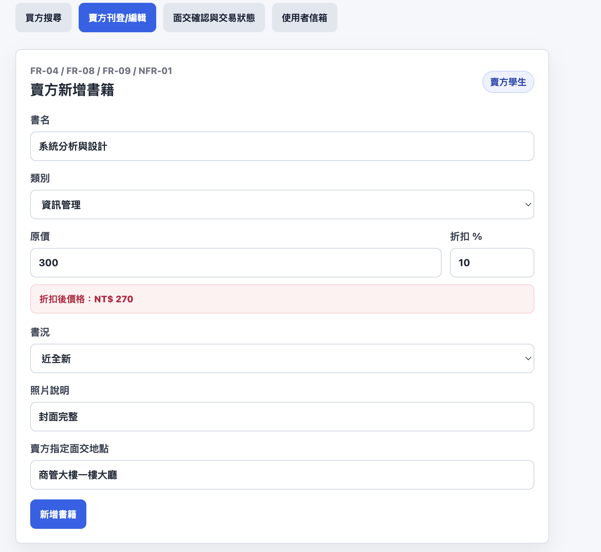
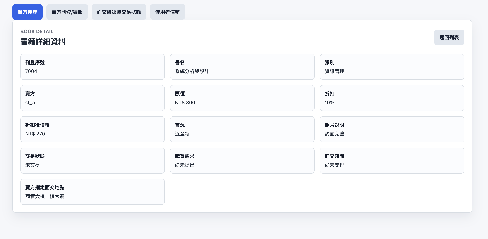
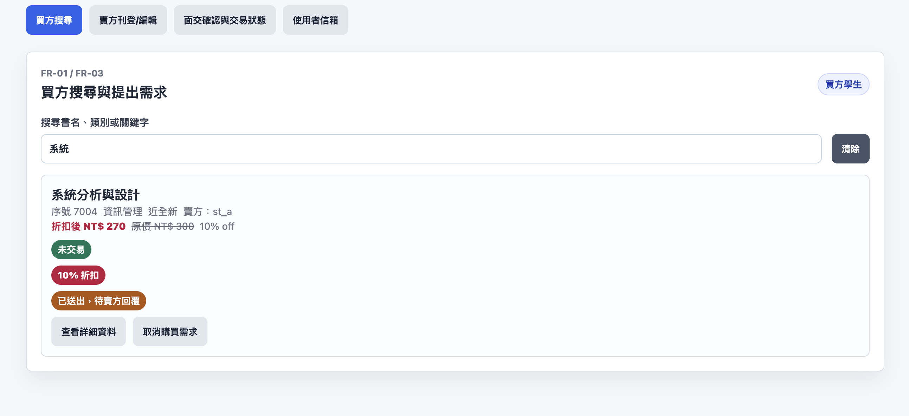
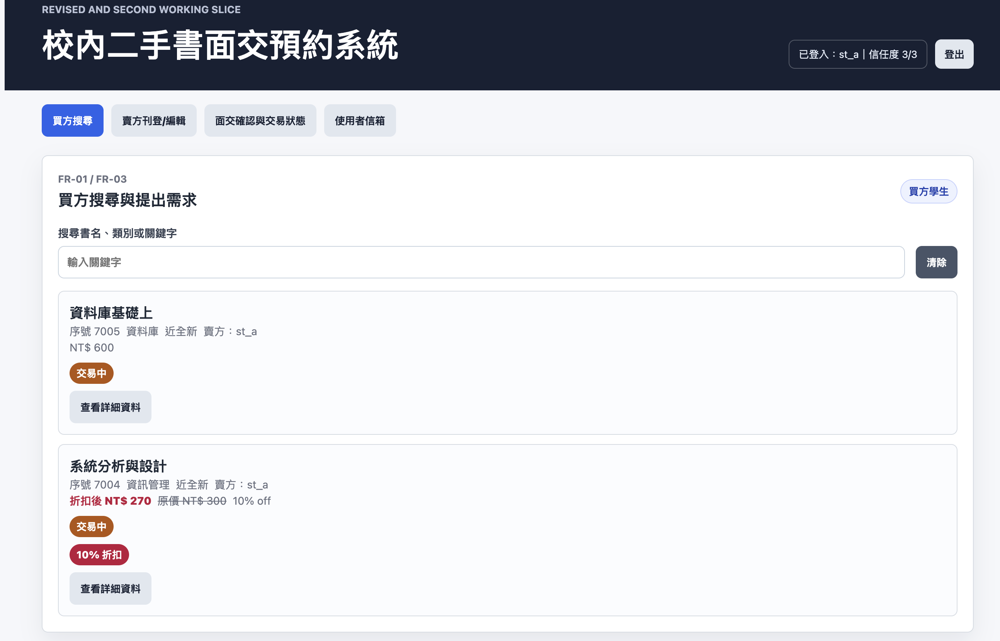
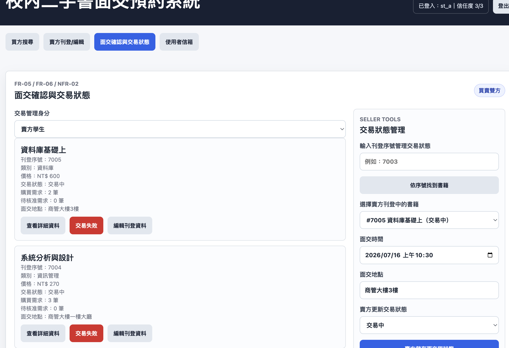
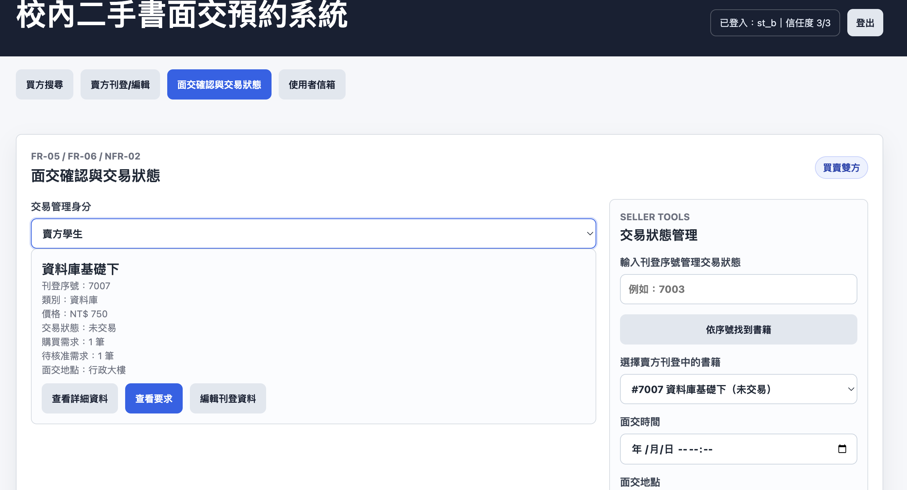
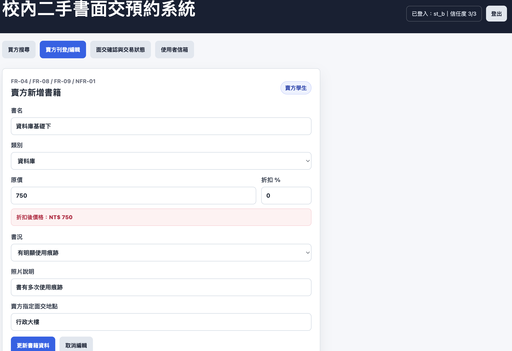
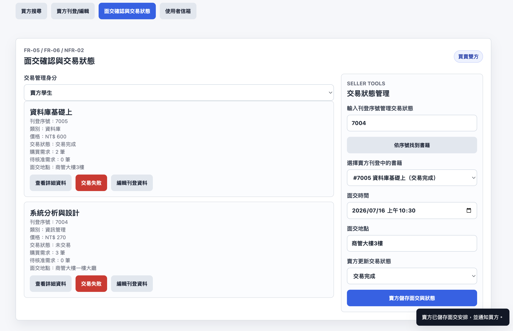

# 手動驗收測試紀錄

## P. 手動驗收測試紀錄

| 測試編號 | 驗收條件 | 前置資料 | 操作步驟 | 預期結果 | 實際結果 | 通過／失敗 | 證據 | 修正與重測 |
| --- | --- | --- | --- | --- | --- | --- | --- | --- |
| MAT-01 | AC-04-01、AC-NFR-01-01 | 開啟修正版切片 | 在新增書籍表單輸入書名、類別、價格、書況、照片說明與賣方指定面交地點 | 表單可輸入必要欄位，不需輸入交易狀態 | 表單顯示書名、類別、價格、折扣、書況、照片說明與賣方指定面交地點欄位，且未出現交易狀態輸入欄位 | 通過 |  | 不需重測 |
| MAT-02 | AC-04-01 | MAT-01 已送出 | 送出新增書籍表單 | 新增書籍出現在書籍列表 | 送出後新增書籍出現在列表，並顯示刊登序號、類別、賣方、價格與未交易狀態 | 通過 |  | 不需重測 |
| MAT-03 | AC-01-01 | 書籍列表有資料 | 在搜尋欄輸入書名、類別或關鍵字 | 列表顯示符合條件的書籍 | 輸入關鍵字後，列表顯示符合書名、類別或關鍵字的書籍 | 通過 |  | 不需重測 |
| MAT-04 | AC-02-01 | 書籍列表有資料 | 點選查看詳細資料 | 進入詳細資料頁面，顯示書籍完整資訊、賣方指定面交地點與交易狀態 | 點選查看詳細資料後進入詳細頁，顯示刊登序號、書名、類別、賣方、價格、書況、照片說明、交易狀態與面交資訊 | 通過 |  | 不需重測 |
| MAT-05 | AC-03-01、AC-03-02、AC-03-03、AC-03-04、AC-03-05、AC-03-06 | 已查看指定書籍詳細資料 | 點選送出購買需求，確認公開/賣方看到未交易、只有提出需求買方看到交易預約中；點選取消購買需求；再建立多筆購買要求，由賣方點選查看要求，確認可看到要求人姓名與發送要求時間，選擇其中一位買方並輸入面交時間後核准 | 未核准時系統狀態為未交易，只有提出需求買方看到交易預約中且可取消；賣方可自由核准其中一位買方；核准後系統自動更新為交易中，其他人的待核准需求自動取消，買方搜尋列表不顯示賣方已核准提示；被核准買方收到交易核准通知，未被選到買方收到書籍已被其他人購買通知 | 買方送出需求後本人可看到已送出待賣方回覆並可取消；賣方可查看要求、選擇買方並核准；核准後交易更新為交易中，其他未被選到需求取消並通知，買方搜尋列表未顯示賣方已核准提示 | 通過 |      | 不需重測 |
| MAT-06 | AC-05-01 | 買方已提出購買需求，交易狀態為交易預約中 | 切換到面交確認與交易狀態分頁，並切換買方學生與賣方學生身分 | 買方身分顯示自己交易中的書籍狀態與資料；賣方身分顯示自己刊登書籍並可更新交易狀態 | 買方可看到自己交易中的書籍狀態與資料；賣方可看到自己刊登資料與交易狀態管理區 | 通過 |   | 不需重測 |
| MAT-07 | AC-08-01 | 開啟修正版第一個可操作切片 | 輸入原價與折扣百分比，送出新增書籍，再查看列表與詳細資料 | 系統顯示折扣後價格，列表與詳細資料可看到原價、折扣與折扣後價格 | 折扣百分比輸入後顯示折扣後價格，列表與詳細資料可看到原價、折扣與折扣後價格 | 通過 |  | 不需重測 |
| MAT-08 | AC-NFR-02-01 | 書籍已有面交時間與地點 | 以非交易當事人查看書籍詳細資料 | 系統自動判斷非交易當事人身分，不顯示面交時間與地點 | 非交易當事人查看詳細資料時，面交資訊顯示為非交易當事人不可見 | 通過 |   | 不需重測 |
| MAT-09 | AC-09-01 | 書籍列表有刊登中的書籍 | 先確認買方搜尋列表沒有編輯刊登資料按鈕，再切換賣方學生身分並於刊登清單點選編輯刊登資料，修改書名、價格或面交地點後送出 | 買方不能編輯刊登資料；賣方可進入賣方刊登/編輯分頁並更新書籍資料，列表與詳細資料頁面顯示更新後內容 | 買方搜尋列表未出現編輯刊登資料入口；賣方刊登清單可進入編輯，修改後資料顯示更新 | 通過 |    | 不需重測 |
| MAT-10 | AC-10-01 | 書籍列表有刊登中的書籍，且可看到刊登序號 | 在面交確認與交易狀態分頁輸入刊登序號並點選依序號找到書籍，再更新交易狀態 | 系統帶入指定書籍，並顯示更新後交易狀態 | 輸入刊登序號後系統帶入指定書籍，右側交易狀態管理區可更新狀態 | 通過 |  | 不需重測 |
| MAT-11 | AC-11-01 | 開啟正式資料庫後端資料夾 | 執行 `python3 server.py --init-only`，並檢查 SQLite 資料表 | 資料庫初始化成功，且可看到 users、books、purchase_requests、notifications 與 sessions 資料表 | 已測試 | 通過 | `formal_database_backend/secondhand_books.sqlite3` | 不需重測 |
| MAT-12 | AC-12-01、AC-13-01 | 啟動正式資料庫後端 | 註冊兩個學生帳號，登入第一個帳號刊登書籍，登入第二個帳號送出購買需求，再由第一個帳號選擇面交時間並核准需求，最後由買方查看信箱 | 同一類型學生帳號可登入後買或賣；賣方核准後買方在自己的信箱收到交易核准與面交時間通知 | 已測試 | 通過 | API 回傳 token、book、purchase_request 與 mailbox notification | 測試資料已清空 |
| MAT-13 | AC-14-01、AC-14-02 | 啟動正式資料庫後端，並已有賣方、買方、書籍、已核准購買需求 | 賣方點選交易失敗；檢查書籍狀態、購買需求、買方信箱與買方信任度；再將買方信任度測試到 0 | 書籍恢復未交易、購買需求取消、買方收到交易失敗通知、信任度扣 1；信任度達 0 時買方停權，系統取消該使用者刊登書籍與購買需求 | 已測試 | 通過 | API 回傳 buyer_trust_score、buyer_suspended；資料庫顯示 is_suspended=1 且測試買方無法登入 | 測試資料已清空 |
