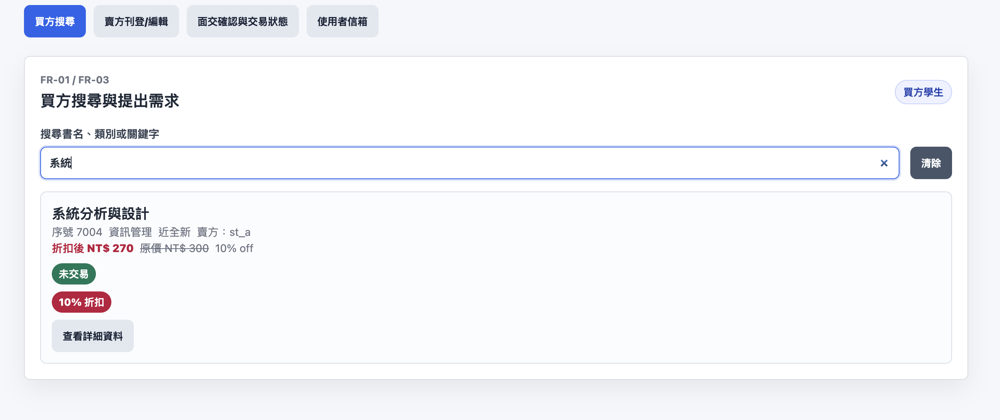
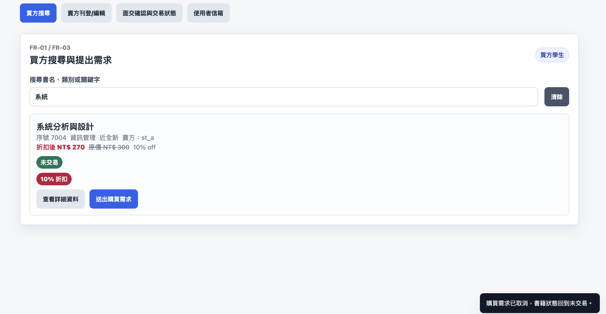
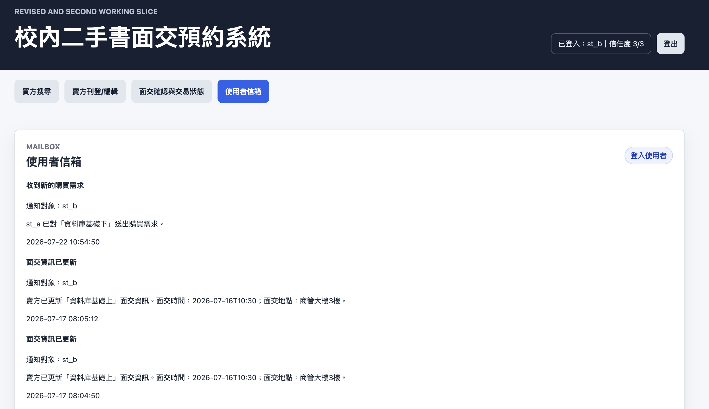
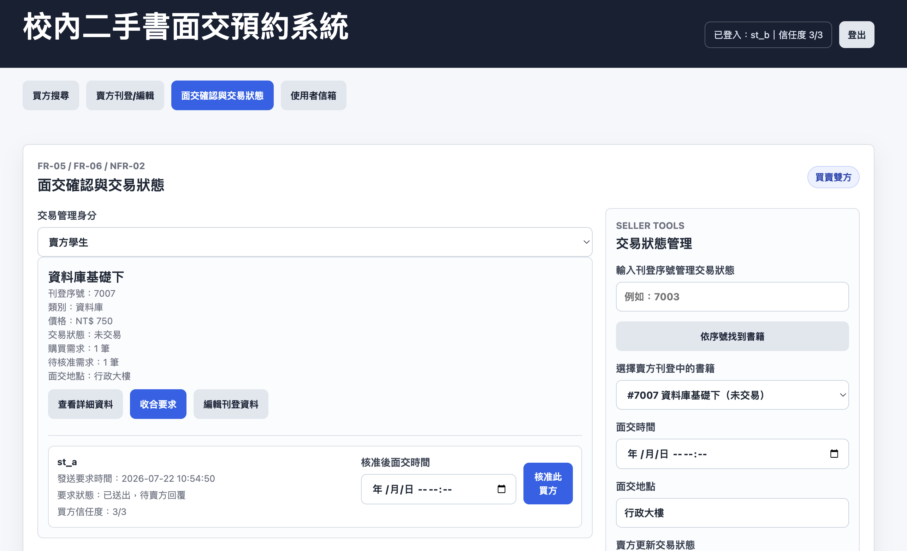
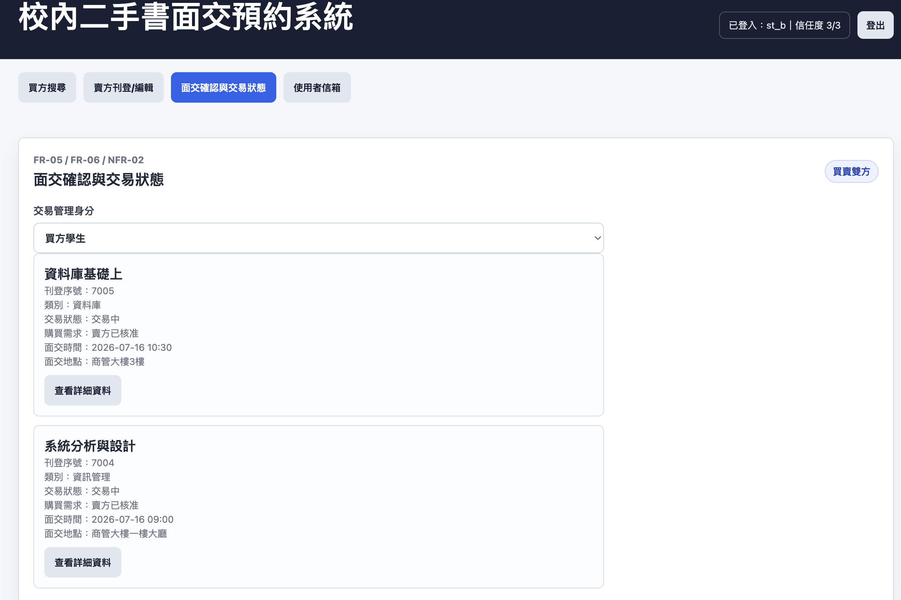
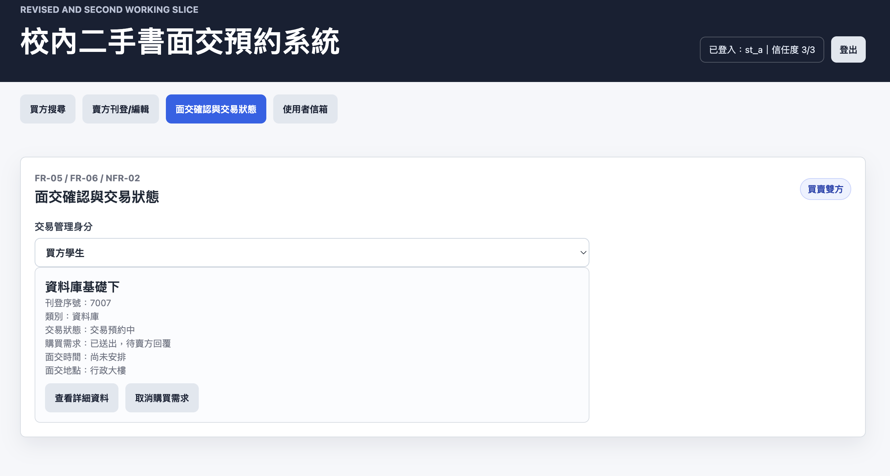

# 0720 手動驗收測試

| 測試編號 | 對應使用案例 | 測試類型 | 前置資料 | 驗收步驟 | 預期結果 | 實際結果 | 通過/失敗 | 證據 |
|---|---|---|---|---|---|---|---|---|
| MAT-0720-01 | UC-04 | 主要流程 | 開啟修正版切片 | 賣方登入後新增一本書，填入書名、類別、價格、書況、照片說明與面交地點 | 書籍成功新增，狀態預設未交易，列表可看到該書 | 0714 基準測試已通過，0720 沿用既有切片並保留此功能 | 通過 |   |
| MAT-0720-02 | UC-04 | 主要流程 | 開啟修正版切片 | 賣方設定折扣百分比並查看折扣後價格 | 畫面同時顯示折扣百分比與折扣後價格 | 0714 基準測試已通過，0720 沿用既有切片並保留此功能 | 通過 |  |
| MAT-0720-03 | UC-01、UC-02 | 主要流程 | 書籍列表有資料 | 買方依書名、類別或關鍵字搜尋，並點選查看詳細資料 | 系統顯示搜尋結果與指定書籍詳細資料 | 0714 基準測試已通過，0720 沿用既有切片並保留此功能 | 通過 |   |
| MAT-0720-04 | UC-03 | 替代流程 | 買方查看非自己刊登的書籍 | 買方送出購買需求，再在未核准前取消 | 需求可成功送出；送出需求時賣方收到通知；未核准前可取消；取消需求時不通知賣方；賣方查看要求同步移除已取消需求；公開狀態維持未交易 | 0720 重測已補上賣方信箱收到新購買需求通知、賣方查看要求與取消後同步移除的證據 | 通過 |      |
| MAT-0720-05 | UC-03 | 例外流程 | 使用者查看自己刊登的書籍 | 賣方查看自己刊登的書籍詳細資料 | 畫面不顯示購買需求按鈕 | 0714 基準測試已通過，0720 沿用既有切片並保留此功能 | 通過 |  |
| MAT-0720-06 | UC-05 | 替代流程 | 同一本書有多筆購買需求 | 賣方查看要求人姓名與發送時間，選擇一位買方並設定面交時間 | 書籍狀態變為交易中；被選買方收到接受與面交時間通知；未被選到者收到已被其他人購買通知 | 0714 基準測試已通過，0720 沿用既有切片並保留此功能 | 通過 |    |
| MAT-0720-07 | UC-06 | 主要流程 | 買方已提出購買需求，賣方已有刊登資料 | 買方與賣方查看交易狀態與信箱 | 只顯示與該使用者相關的交易資料與通知 | 0714 基準測試已通過，0720 沿用既有切片並保留此功能 | 通過 |   |
| MAT-0720-08 | UC-08 | 例外流程 | 已有賣方、買方、書籍與已核准購買需求 | 賣方標記交易失敗，並檢查買方信任度與書籍狀態 | 系統通知買方交易失敗，取消需求，書籍改回未交易並扣信任度 | 0714 API 基準測試已通過；0720 沿用正式資料庫後端並保留此功能 | 通過 | 0714 MAT-13 API 測試紀錄；`formal_database_backend/server.py` |
| MAT-0720-09 | UC-08 | 例外流程 | 買方信任度可被交易失敗扣分 | 信任度達到 0 時檢查停權處理 | 系統管理員停權該使用者，並取消其刊登書籍與購買需求 | 0714 API 基準測試已通過；0720 沿用正式資料庫後端並保留此功能 | 通過 | 0714 MAT-13 API 測試紀錄；`formal_database_backend/server.py` |
| MAT-0720-10 | UC-09 | 主要流程 | 啟動正式資料庫後端 | 使用者註冊並登入 | 系統建立帳號並可用該帳號進入系統 | 0714 API 基準測試已通過；0720 沿用正式資料庫後端並保留此功能 | 通過 | 0714 MAT-12 API 測試紀錄；`formal_database_backend/server.py` |

## 待補項目

- Git commit 後需回填 `0720.md` 的提交紀錄。
